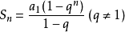

## 算法学习笔记 算法中的数学
---
### 集合

+ 2个整数集合内所有数，相加且相乘结果一样，2个集合的内容一样。（适用于限制于某个范围类的一系列数匹配）
+ 已知Sn=1+1/2+1/3+...+1/n Sn为第n个调和数，值=ln(n+1)+γ（γ约等于0.5772156649）
+ 等比数列求和公式(常用于每次与前一次成比列):  

+ 构成三角形的条件：任意两边之和大于第三边
+ 构成直角三角形：两短边的平方和等于长边的平方
---

#### [返回目录](./)
