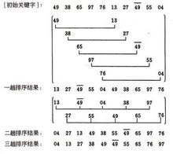

## 算法学习笔记 排序算法
---

+ 各排序算法的对比

+ 梳排序：图上没有，详见下文梳排序内容。


+ 排序（选择<冒泡=插入<希尔< 归并(稳定，nlogn) ~= 快速(利用缓存) ~= 堆（nlogn,空间小）

+ 稳定：如果a原本在b前面，而a=b，排序之后a仍然在b的前面。

+ 不稳定：如果a原本在b的前面，而a=b，排序之后 a 可能会出现在 b 的后面。

+ 时间复杂度：对排序数据的总的操作次数。反映当n变化时，操作次数呈现什么规律。

* 空间复杂度：是指算法在计算机


---
### 1. 选择排序  

&emsp;&emsp;就是从需要排序的数据中选择最小的记录下来，然后放在第一个，选择第二小的放在第二个，依次下去。 
+ 时间复杂度：N<sup>2</sup>
+ 交换次数：N
+ 特点：稳定，不受数据顺序好坏影响，交换次数少


```
/**
 * 选择排序 方法
 * 时间：平均n2 最坏n2 最好n2
 * 空间：1
 * 不稳定
 * @function
 * @param {Object} arr 数组
 * @returns 排序后的素组
 */
function selectionSort(arr,compare){
  for(let i=0;i<arr.length;i++){
    let inx = i;
    for(let j=i+1;j<arr.length;j++){
      if(compare(arr[inx],arr[j])>0){
        inx = j;
      }
    }
    swap(arr,i,inx);
  }
  return arr;
}
```

---
### 2. 插入排序  

&emsp;&emsp;遍历数组，对于每一个元素，循环与前面的元素比较，直到遇到比该元素小的为止，把元素插入到该位置后面，数组实现中可以一边比较一边交换的移动。  

+ 时间复杂度：N<sup>2</sup>
+ 比较次数：最好（N）最坏（N<sup>2</sup>）平均（N<sup>2</sup>）
+ 交换次数：最好（0） 最坏（N<sup>2</sup>） 平均（N<sup>2</sup>）
+ 特点：顺序倒置少，速度快


```
/**
 * 插入排序 方法
 * 时间：平均n2 最坏n2 最好n
 * 空间：1
 * 稳定
 * @function
 * @param {Object} arr 数组
 * @returns 排序后的素组
 */
function insertionSort(arr,compare){
  for(let i=1;i<arr.length;i++){
    let current = arr[i];
    let j;
    for(j=i-1;j>0 && compare(arr[j],current)>0;j--){
      arr[j+1] = arr[j];
    }
    arr[j+1] = current;
  }
  return arr;
}

```

---
### 3. 冒泡排序  

&emsp;&emsp;小数字慢慢往上浮，让大的数字沉淀在下方。每次冒泡结束后，当前子序列的最后一个数最大。下一轮冒泡进行到倒数第二个元素。依次进行。

+ 时间复杂度：N<sup>2</sup>
+ 特点：比较次数等于选择，交换次数等于插入。比前面两个算法效率差一点点。


```
/**
 * 冒泡排序 方法
 * 时间：平均n2 最坏n2 最好n
 * 空间：1
 * 稳定
 * @function
 * @param {Object} arr 数组
 * @returns 排序后的素组
 */
function bubbleSort(arr,compare){
  for(let i=0;i<arr.length;i++){
    for(let j=0;j<arr.length-i-1;j++){
      if(compare(arr[j],arr[j+1])>0){
        swap(arr,j,j+1);
      }
    }
  }
  return arr;
}
```

&emsp;&emsp;可以优化冒泡排序，当某一次遍历的每一对都没有交换，那么表示已经拍好顺序了，则无需再进行后续比较。

---
### 4. 梳排序  

&emsp;&emsp;梳排序是对冒泡排序的改良，因为冒泡排序比较和交换的是相邻数，也就是说间距为1的数字，梳排序的理念是这个间距可以大于1，这样就可以改善小数字在数组末尾情况的效率。

+ 时间复杂度：NlogN


```
//梳排序算法，从小到大
template <typename T>
void combSort(T arr[],int begin, int end) {
	int step = (int)((end - begin +1) * 0.8);   // 0.8 = 1 / 1.3
	while (step >= 1) {
		for (int i = begin; i <= end; ++i) {
			int des = i + step;
			if (des > end) {
				break;
			}
			else if (arr[i] > arr[des]) {
				swap(arr[i], arr[des]);
			}
		}
		step *= 0.8;
	}
}
```

---
### 5. 希尔排序  

&emsp;&emsp;希尔排序是插入排序的一种改进，通过分组的方式，对每一组进行插入排序，逐渐缩小增量，达到高效排序方式。在编写代码的时候可以对插入排序的算法稍加更改，就可以实现。

+ 时间复杂度：NlogN




```

/**
 * 希尔排序 方法 （分组进行插入排序）
 * 时间：平均n1.5 最坏n2 最好n
 * 空间：1
 * 不稳定
 * @function
 * @param {Object} arr 数组
 * @returns 排序后的素组
 */
function shellSort(arr,compare){
  //分组
  for(let gap = Math.floor(arr.length/2);gap>0;gap=Math.floor(gap/2)){
    //按不同分组，同间隔来处理
    for(let i=gap;i<arr.length;i++){
      let current = arr[i];
      let j;
      for(j=i-gap;j-gap>=0 && compare(arr[j],current)>0;j-=gap){
        arr[j+gap] = arr[j];
      }
      arr[j+gap] = current;
    }
  }
  return arr;
}
```

---
### 6. 快速排序  

&emsp;&emsp;从数组中选择一个元素，我们把这个元素称之为中轴元素吧，然后把数组中所有小于中轴元素的元素放在其左边，所有大于或等于中轴元素的元素放在其右边，显然，此时中轴元素所处的位置的是有序的。也就是说，我们无需再移动中轴元素的位置。然后再分别对中轴元素左右两个子数列递归进行上述操作。

+ 时间复杂度：NlogN
+ 特点：平均时间复杂度是最稳定于：NlogN的算法


```

/**
 * 快速排序 方法(分治：选基准，以基准值为中间值，分成两部分)
 * 时间：平均nlogn 最坏n2 最好nlogn
 * 空间：nlogn
 * 不稳定
 * @function
 * @param {Object} arr 数组
 * @returns 排序后的素组
 */
function quickSort(arr,compare){
  quickSort_split(arr,0,arr.length-1,compare)
  return arr;
}


function quickSort_split(arr,left,right,compare) {
  if(left>=right)
    return;
  let tem = arr[left]; //基准
  let i = left,j = right;
  while(i<j){
    while(i<j && compare(arr[j],tem)>=0)j--;
    arr[i] = arr[j];
    while(i<j && compare(arr[i],tem)<=0)i++;
    arr[j] = arr[i];
  }
  arr[i] = tem;
  quickSort_split(arr,left,i-1,compare);
  quickSort_split(arr,i+1,right,compare);
}
```

---
### 7. 堆排序  

&emsp;&emsp;堆排序是利用堆这个数据结构而设计的一种排序算法，构造一个堆。  
&emsp;&emsp;堆是具有以下性质的完全二叉树：每个结点的值都大于或等于其左右孩子结点的值，称为大顶堆；或者每个结点的值都小于或等于其左右孩子结点的值，称为小顶堆。  
&emsp;&emsp;大顶堆实现从小到大，小顶堆实现从大到小排序。可以用数组来存储一个二叉树，k节点的两个子节点在2k+1和2k+2位置。而k节点的父节点在(k+1)/2-1位置。每次让大顶堆的顶与最后一个元素交换，然后再把顶上这个元素下沉，构成新的大顶堆。  

+ 时间复杂度：NlogN
+ 特点：堆排序算是选择排序的一个变种，最好、最坏、平均的时间复杂都为O(nlogn)，空间复杂度为O(1)，是一种不稳定的排序。


```
/**
 * 堆排序(利用数据结构堆来实现排序)
 * 时间：平均nlogn 最坏nlogn 最好nlogn
 * 空间：1
 * 不稳定
 * @function
 * @param {Object} arr 数组
 * @returns 排序后的素组
 */
 function heapSort(arr,compare){
  //构建堆
  for(let i = Math.floor(arr.length/2);i>=0;i--){
    heapify(arr,arr.length,i,compare);
  }

  //取值，调整
  for(let i = arr.length-1;i>0;i--){
    swap(arr,0,i);
    heapify(arr,i,0,compare);
  }


  return arr;
}

function heapify(arr,len,i,compare) {
  let left = 2*i+1, right = 2*i+2;
  let largest = i;
  if(left<len && compare(arr[left],arr[largest])>0)
    largest = left;

  if(right<len && compare(arr[right],arr[largest])>0)
    largest = right;

  if(largest!=i){
    swap(arr,largest,i);
    heapify(arr,len,largest,compare);
  }
}
```

---
### 8. 归并排序  

&emsp;&emsp;归并排序使用的是分治的思想，先把原数组分成两个大小尽量相等的子数组，再分别对这个两个子数组排序，最后合并两个有序子数组。

+ 时间复杂度：NlogN
+ 特点：相对稳定，但是需要额外的空间


```
/**
 * 归并排序 方法 （分治：二分，子序列合并（中间数组实现有序））
 * 时间：平均nlogn 最坏nlogn 最好nlogn
 * 空间：n
 * 稳定
 * @function
 * @param {Object} arr 数组
 * @returns 排序后的素组
 */
function mergeSort(arr,compare){
  return mergeSort_split(arr,compare);
}

function mergeSort_split(arr,compare){
  if(arr.length < 2)
    return arr;

  let middle = Math.floor(arr.length / 2);
  //分
  let left = mergeSort_split(arr.slice(0,middle),compare);
  let right = mergeSort_split(arr.slice(middle),compare);
  //治
  return mergeSort_merge(left,right,compare);
}


function mergeSort_merge(left,right,compare){
  let res = [];
  while(left.length>0 && right.length>0){
    if(compare(left[0],right[0])<0)
      res.push(left.shift());
    else
      res.push(right.shift());
  }

  res.push(...left);
  res.push(...right);

  return res;

}
```

---
### 9. 计数排序（只适用于整数）  

&emsp;&emsp;计数排序的思想是将输入的数据转换成键存储在额外的空间中，计数排序要求输入的数据在一定的范围之内。使用一个额外的数组C，其中第i个元素的待排序数组A中值等于i的元素的个数。然后根据数据C来排序。

+ 时间复杂度：N+K
+ 特点：稳定，只适用于整数，非比较排序


```
//计数排序，从小到大
void countSort(int arr[],int begin,int end){
	int min, max,px;
	min = max = arr[begin];

	for (int i = begin+1; i <= end; ++i){
		if (arr[i]>max)
			max = arr[i];
		if (arr[i] < min)
			min = arr[i];
	}
	//最小偏移
	px = 0 - min;
	int len = max - min + 1;
	int *tems = new int[len]();
	//计数
	for (int i = begin; i <= end; ++i){
		tems[arr[i] + px]++;
	}
	//排序
	for (int i = 0,inx=begin; i < len; ++i){
		while (tems[i]-->0){
			arr[inx++] = i-px;
		}
	}
}
```

---
### 10. 桶排序（只适用于整数）  

&emsp;&emsp;桶排序是对计数排序的一种归纳，能够适当平衡时间复杂度和空间复杂度，在数据均匀分布的时候效果比较好。  
&emsp;&emsp;原理是创建一定数量的桶，每个桶里面可以装一个数据段的不同数据，数据段（桶）是按数组顺序排列的，使用不定长度线性表存储每个桶的数据，这样可以节省一定的空间。对于每个桶的数据，可以配合其他排序算法排序。

+ 时间复杂度：n+k 到 n<sup>2</sup> 之间
+ 特点：也比较稳定，把计数排序中装一个数据的桶，扩展成装一段数据的桶


```
//桶排序，从小到大
//意义不大，需要配合其他排序算法，可体会算法研究的思维
//对计数排序的优化，运用分治思想等，虽然效果不明显
void bucketSort(int arr[], int begin, int end){
	int min, max, px;
	min = max = arr[begin];

	for (int i = begin + 1; i <= end; ++i){
		if (arr[i]>max)
			max = arr[i];
		if (arr[i] < min)
			min = arr[i];
	}
	//每个桶最多装10个元素
	min /= 10, max /= 10;
	
	int len = max - min + 1;
	px = 0 - min;
	vector<int> *tems = new vector<int>[len];

	for (int i = begin; i <= end; ++i){
		int inx = arr[i] / 10;
		tems[inx+px].push_back(arr[i]);
	}

	for (int i = 0,index=begin; i < len; ++i){
		if (tems[i].size()>0){
			sort(tems[i].begin(), tems[i].end());
			for (auto p = tems[i].begin(); p < tems[i].end(); p++){
				arr[index++] = *p;
			}
		}
		
	}
	
	delete[] tems;
}
```

---
### 11. 基数排序（只适用于正整数）  

&emsp;&emsp;基数排序只适用于正整数，主要是按基数从低到高来排序，而内层排序用到了桶排序的思想。  

+ 时间复杂度：n*k


```
//基数排序，从小到大
//桶排序的计数排序的优化
//只用于正整数
void radixSort(int arr[], int begin, int end){
	int max,radix=0;
	max = arr[begin];

	for (int i = begin + 1; i <= end; ++i){
		//负数无法排序
		if (arr[i]<0)
			return;
		if (arr[i]>max)
			max = arr[i];
	}
	//求位数
	for (; max > 0; radix++){
		max /= 10;
	}
	//准备10个数组
	vector<int> tems[10];
	//按基数从低到高运用桶排序
	for (int k = 0; k < radix;++k){
		for (int i = begin; i <= end; ++i){
			int key = arr[i] / (int)pow(10, k) % 10;
			tems[key].push_back(arr[i]);
		}
		for (int i = 0,index=begin; i < 10; ++i){
			for (auto p = tems[i].begin(); p < tems[i].end(); p++){
				arr[index++] = *p;
			}
			tems[i].clear();
		}
	}
}
```


---

#### [返回目录](./)