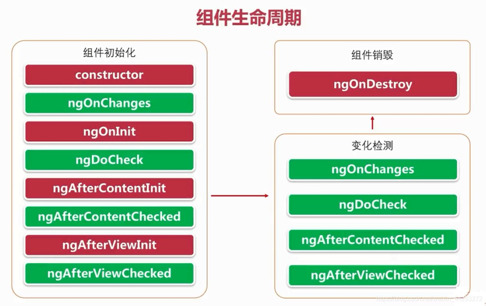

## Angular学习笔记 组件

---

### 1. 组件内容

每个组件包括如下部分：

- 一个 HTML 模板，用于声明页面要渲染的内容
- 一个用于定义行为的 Typescript 类
- 一个 CSS 选择器，用于定义组件在模板中的使用方式
- （可选）要应用在模板上的 CSS 样式

### 2. CLI创建组件

运行 `ng generate component <component-name>` 命令，其中 `<component-name>` 是新组件的名字。

该命令会创建以下内容：

- 一个以该组件命名的文件夹
- 一个组件文件 `<component-name>.component.ts`
- 一个模板文件 `<component-name>.component.html`
- 一个 CSS 文件， `<component-name>.component.css`
- 测试文件 `<component-name>.component.spec.ts`

### 3. 手动创建组件

1. 导航到你的 Angular 项目目录。

2. 创建一个新文件 `<component-name>.component.ts` 。

3. 在文件的顶部，添加下面的 import 语句。

   ```
   import { Component } from '@angular/core';
   ```

4. 在 `import` 语句之后，添加一个 `@Component` 装饰器。

   ```
   @Component({
   })
   ```

5. 为组件选择一个 CSS 选择器。

   ```
   @Component({
     selector: 'app-component-overview',
   })
   ```

   每个组件都需要一个 CSS *选择器*。选择器会告诉 Angular：当在模板 HTML 中找到相应的标签时，就把该组件实例化在那里。例如，考虑一个组件 `hello-world.component.ts` ，它的选择器定义为 `app-hello-world` 。 当 `<app-hello-world>` 出现在模板中时，这个选择器就会让 Angular 实例化该组件

6. 定义组件用以显示信息的 HTML 模板。在大多数情况下，这个模板是一个单独的 HTML 文件。

   ```
   @Component({
     selector: 'app-component-overview',
     templateUrl: './component-overview.component.html',
   })
   ```

   模板是一段 HTML，它告诉 Angular 如何在应用中渲染组件。可以通过以下两种方式之一为组件定义模板：引用外部文件，或直接写在组件内部。

   要把模板定义为外部文件，就要把 `templateUrl` 添加到 `@Component` 装饰器中。

   要在组件中定义模板，就要把一个 `template` 属性添加到 `@Component` 中，该属性的内容是要使用的 HTML。

   ```
   @Component({
     selector: 'app-component-overview',
     template: '<h1>Hello World!</h1>',
   })
   ```

   **Angular 组件需要一个用 `template` 或 `templateUrl` 定义的模板。但你不能在组件中同时拥有这两个语句。**

7. 为组件的模板选择样式。在大多数情况下，你可以在单独的文件中定义组件模板的样式。

   ```
   @Component({
     selector: 'app-component-overview',
     templateUrl: './component-overview.component.html',
     styleUrls: ['./component-overview.component.css']
   })
   ```

   有两种方式可以为组件的模板声明样式：**引用一个外部文件，或直接写在组件内部**。

   要在单独的文件中声明组件的样式，就要把 `styleUrls` 属性添加到 `@Component` 装饰器中。

   要想在组件内部声明样式，就要把 `styles` 属性添加到 `@Component`，该属性的内容是你要用的样式。

   ```
   @Component({
     selector: 'app-component-overview',
     template: '<h1>Hello World!</h1>',
     styles: ['h1 { font-weight: normal; }']
   })
   ```

   `styles` 属性接受一个包含 CSS 规则的字符串数组。

8. 添加一个包含该组件代码 `class` 语句。

   ```
   export class ComponentOverviewComponent {
   
   }
   ```

### 4. 生命周期

可以通过实现一个或多个 Angular `core` 库中定义的**生命周期钩子接口**来响应组件或指令生命周期中的事件。这些钩子让你有机会在适当的时候对组件或指令实例进行操作，比如 Angular 创建、更新或销毁这个实例时。

**每个接口都有唯一的一个钩子方法，它们的名字是由接口名再加上 `ng` 前缀构成的**。比如，`OnInit` 接口的钩子方法叫做 `ngOnInit()`。如果你在组件或指令类中实现了这个方法，Angular 就会在首次检查完组件或指令的输入属性后，紧接着调用它：

```
@Directive({selector: '[appPeekABoo]'})
export class PeekABooDirective implements OnInit {
  constructor(private logger: LoggerService) { }

  // implement OnInit's `ngOnInit` method
  ngOnInit() {
    this.logIt('OnInit');
  }

  logIt(msg: string) {
    this.logger.log(`#${nextId++} ${msg}`);
  }
}
```

**不必实现所有生命周期钩子，只要实现你需要的那些就可以了**

#### 4.1 生命周期的顺序

| 钩子方法                  | 用途                                                         | 时机                                                         |
| :------------------------ | :----------------------------------------------------------- | :----------------------------------------------------------- |
| `ngOnChanges()`           | 当 Angular 设置或重新设置数据绑定的输入属性时响应。 该方法接受当前和上一属性值的 `SimpleChanges` 对象<br />注意，这发生的非常频繁，所以你在这里执行的任何操作都会显著影响性能。 | 如果组件绑定过输入属性，那么在 `ngOnInit()` 之前以及所绑定的一个或多个输入属性的值发生变化时都会调用。<br />注意，如果你的组件没有输入属性，或者你使用它时没有提供任何输入属性，那么框架就不会调用 `ngOnChanges()`。 |
| `ngOnInit()`              | 在 Angular 第一次显示数据绑定和设置指令/组件的输入属性**之后**，**初始化指令/组件**。 | 在第一轮 `ngOnChanges()` 完成之后调用，只调用**一次**。而且即使没有调用过 `ngOnChanges()`，也仍然会调用 `ngOnInit()`（比如当模板中没有绑定任何输入属性时）。 |
| `ngDoCheck()`             | 检测，并在发生 Angular 无法或不愿意自己检测的变化时作出反应。 | 紧跟在每次执行变更检测时的 `ngOnChanges()` 和 首次执行变更检测时的 `ngOnInit()` 后调用。**即有init，在init后** |
| `ngAfterContentInit()`    | 当 Angular 把外部内容投影进组件视图或指令所在的视图之后调用。 | 第一次 `ngDoCheck()` 之后调用，**只调用一次**。              |
| `ngAfterContentChecked()` | 每当 Angular 检查完被投影到组件或指令中的内容之后调用。      | `ngAfterContentInit()` 和每次 `ngDoCheck()` 之后调用。**即有contentinit，在contentinit后** |
| `ngAfterViewInit()`       | 当 Angular 初始化完组件视图及其子视图或包含该指令的视图之后调用。 | 第一次 `ngAfterContentChecked()` 之后调用，只调用一次。      |
| `ngAfterViewChecked()`    | 每当 Angular 做完组件视图和子视图或包含该指令的视图的变更检测之后调用。 | `ngAfterViewInit()` 和每次 `ngAfterContentChecked()` 之后调用。**即有viewinit，在viewinit后** |
| `ngOnDestroy()`           | 每当 Angular 每次销毁指令/组件之前调用并清扫。 在这儿反订阅可观察对象和分离事件处理器，以防内存泄漏。 |                                                              |




---

#### [返回目录](./)