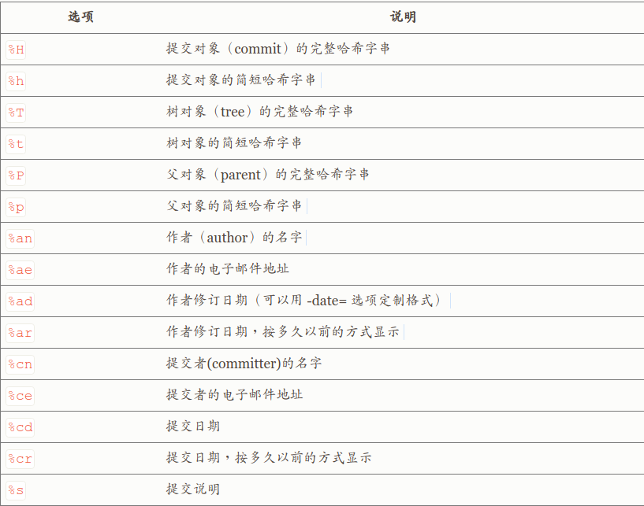
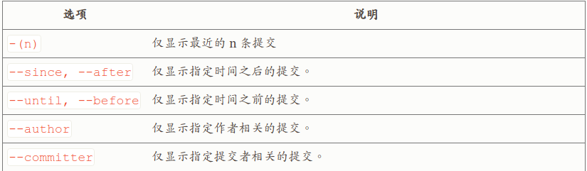

## Git学习笔记 历史
---
### 1.查看历史

&emsp;&emsp;使用如下命令可以查看提交历史记录：
```
git log
```
&emsp;&emsp;默认不用任何参数的话，git log 会按提交时间列出所有的更。常用 -p 选项展开显示每次提交的内容差异，用 -<n> 则仅显示最近的n次更新。还有个常用的 --pretty 选项，可以指定使用完全不同于默认格式的方式展示提交历，format值可以定制要显示的记录格式，例如：
```
git log --pretty=format:"%h - %an, %ar : %s"
```  
&emsp;&emsp;其中格式占位符写法及其代表的意义如下：  



---
### 2.限制输出长

&emsp;&emsp;可以通过一下参数来限制输出的内容范围：



---

#### [返回目录](./)
