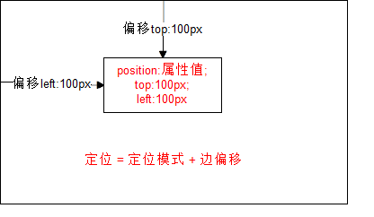
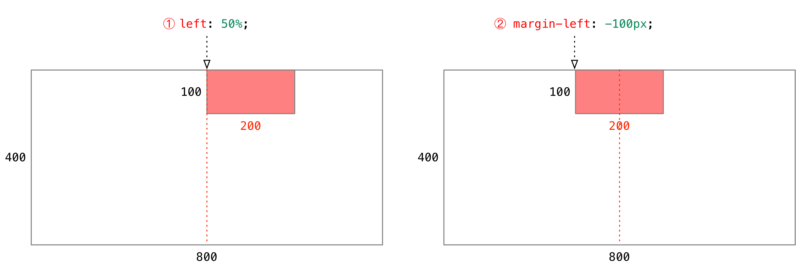

## HTML+CSS学习笔记 CSS定位

---

定位也是用来布局的，它有两部分组成：

> `定位 = 定位模式 + 边偏移`

### 1.边偏移

简单说， 我们定位的盒子，是通过边偏移来移动位置的。

在 CSS 中，通过 `top`、`bottom`、`left` 和 `right` 属性定义元素的**边偏移**：（方位名词）

| 边偏移属性 | 示例           | 描述                                                     |
| ---------- | :------------- | -------------------------------------------------------- |
| `top`      | `top: 80px`    | **顶端**偏移量，定义元素相对于其父元素**上边线的距离**。 |
| `bottom`   | `bottom: 80px` | **底部**偏移量，定义元素相对于其父元素**下边线的距离**。 |
| `left`     | `left: 80px`   | **左侧**偏移量，定义元素相对于其父元素**左边线的距离**。 |
| `right`    | `right: 80px`  | **右侧**偏移量，定义元素相对于其父元素**右边线的距离**   |

定位的盒子有了边偏移才有价值。 一般情况下，凡是有定位地方必定有边偏移。

### 2.定位模式 (position)

在 CSS 中，通过 `position` 属性定义元素的**定位模式**，语法如下：

```css
选择器 { position: 属性值; }
```

定位模式是有不同分类的，在不同情况下，我们用到不同的定位模式。

| 值         |         语义         |
| ---------- | :------------------: |
| `static`   | **静态**定位（默认） |
| `relative` |     **相对**定位     |
| `absolute` |     **绝对**定位     |
| `fixed`    |     **固定**定位     |

 

#### 3. 静态定位(static) - 了解

- **静态定位**是元素的默认定位方式，无定位的意思。它相当于 border 里面的none， 不要定位的时候用。
- 静态定位 按照标准流特性摆放位置，它没有边偏移。
- 静态定位在布局时我们几乎不用的 

#### 4. 相对定位(relative) - 重要

- **相对定位**是元素**相对**于它  原来在标准流中的位置 来说的。（自恋型）

**效果图**：


相对定位的特点：（务必记住）

- 相对于 自己原来在标准流中位置来移动的
- 原来**在标准流的区域继续占有**，后面的盒子仍然以标准流的方式对待它。


#### 4. 绝对定位(absolute) - 重要  

**绝对定位**是元素以带有定位的父级元素来移动位置 （拼爹型）

1. **完全脱标** —— 完全不占位置；  

2. **父元素没有定位**，则以**浏览器**为准定位（Document 文档）。

   

3. **父元素要有定位**

   * 将元素依据最近的已经定位（绝对、固定或相对定位）的父元素（祖先）进行定位。


绝对定位的特点：（务必记住）

- 绝对是以带有定位的父级元素来移动位置 （拼爹型） 如果父级都没有定位，则以浏览器文档为准移动位置
- 不保留原来的位置，完全是脱标的。

因为绝对定位的盒子是拼爹的，所以要和父级搭配一起来使用。

#### 5. 固定定位(fixed) - 重要

**固定定位**是**绝对定位**的一种特殊形式： （认死理型）   如果说绝对定位是一个矩形 那么 固定定位就类似于正方形

1. **完全脱标** —— 完全不占位置；
2. 只认**浏览器的可视窗口** —— `浏览器可视窗口 + 边偏移属性` 来设置元素的位置；
   * 跟父元素没有任何关系；单独使用的
   * 不随滚动条滚动。

> > 案例演练：固定定位案例。
>
> 
>
> **提示**：IE 6 等低版本浏览器不支持固定定位。


### 6. 绝对定位的盒子居中

> **注意**：**绝对定位/固定定位的盒子**不能通过设置 `margin: auto` 设置**水平居中**。

在使用**绝对定位**时要想实现水平居中，可以按照下图的方法：



1. `left: 50%;`：让**盒子的左侧**移动到**父级元素的水平中心位置**；
2. `margin-left: -100px;`：让盒子**向左**移动**自身宽度的一半**。

> 案例演示：相对定位案例。

#### 盒子居中定位示意图


> 课堂练习：实现**盒子左中、右中、中上、中下、中中定位**（5 分钟）。


---

#### [返回目录](./)

