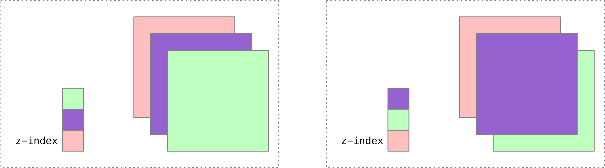

## HTML+CSS学习笔记 CSS堆叠顺序

---

### 1.堆叠顺序（z-index）

在使用**定位**布局时，可能会**出现盒子重叠的情况**。

加了定位的盒子，默认**后来者居上**， 后面的盒子会压住前面的盒子。

应用 `z-index` 层叠等级属性可以**调整盒子的堆叠顺序**。如下图所示：

`z-index` 的特性如下：

1. **属性值**：**正整数**、**负整数**或 **0**，默认值是 0，数值越大，盒子越靠上；
2. 如果**属性值相同**，则按照书写顺序，**后来居上**；
3. **数字后面不能加单位**。

**注意**：`z-index` 只能应用于**相对定位**、**绝对定位**和**固定定位**的元素，其他**标准流**、**浮动**和**静态定位**无效。

> 案例演示：堆叠顺序。

---

#### [返回目录](./)

