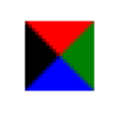

## HTML+CSS学习笔记 CSS三角形

---

### 1. 原理

1. 我们用css 边框可以模拟三角效果

2. 宽度高度为0

3. **我们4个边框都要写， 只保留需要的边框颜色，其余的不能省略，都改为 transparent 透明就好了**

4. 为了照顾兼容性 低版本的浏览器，加上 font-size: 0;  line-height: 0;

   

### 2. 实现

```
 div {

 	width: 0; 

    height: 0;
    line-height:0；
    font-size: 0;
	border-top: 10px solid red;

	border-right: 10px solid green;

	border-bottom: 10px solid blue;

	border-left: 10px solid #000; 

 }
```


---

#### [返回目录](./)

