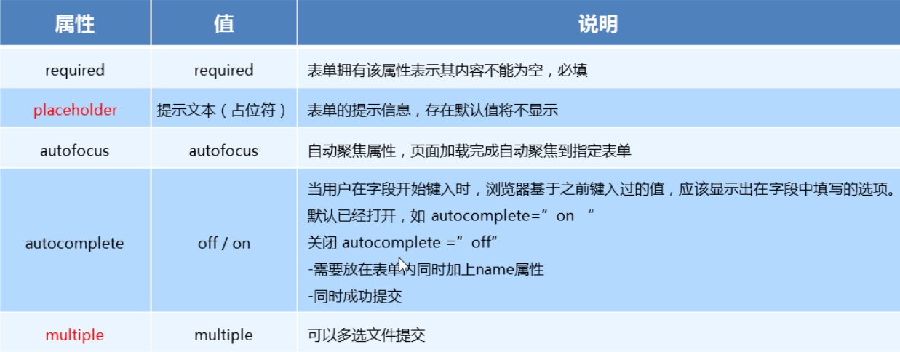

## HTML+CSS学习笔记 HTML5

### 一、什么是 `HTML5`

1. `HTML5` 的概念与定义 

   - 定义：`HTML5` 定义了 `HTML` 标准的最新版本，是对 `HTML` 的第五次重大修改，号称下一代的 `HTML` 
   - 两个概念：
     - 是一个新版本的 `HTML` 语言，定义了新的标签、特性和属性
     - 拥有一个强大的技术集，这些技术集是指： `HTML5` 、`CSS3` 、`javascript`, 这也是广义上的 `HTML5`

2. `HTML5` 拓展了哪些内容

   - 语义化标签
   - 本地存储
   - 兼容特性
   - `2D`、`3D` 
   - 动画、过渡
   - `CSS3` 特性
   - 性能与集成

3. `HTML5 ` 的现状

     绝对多数新的属性，都已经被浏览器所支持，最新版本的浏览器已经开始陆续支持最新的特性，

     总的来说：`HTML5` 已经是大势所趋


### 二、`HTML5 ` 新增语义化标签

 1. 什么是语义化

    合理HTML标记以及其特有的属性去格式化文档内容

 2. 新增了那些语义化标签

    - `header`   ---  头部标签
    - `nav`        ---  导航标签
    - `article` ---   内容标签
    - `section` ---   块级标签
    - `aside`     ---   侧边栏标签
    - `footer`   ---   尾部标签

    

    

 3. 使用语义化标签的注意

    - 语义化标签主要针对搜索引擎
    - 新标签可以使用一次或者多次
    - 在 `IE9` 浏览器中，需要把语义化标签都转换为块级元素
    - 语义化标签，在移动端支持比较友好，
    - 另外，`HTML5` 新增的了很多的语义化标签，随着课程深入，还会学习到其他的


### 三、多媒体音频标签

1. `audio` 标签说明

   - 可以在不使用标签的情况下，也能够原生的支持音频格式文件的播放，
   - 但是：播放格式是有限的

2. audio 支持的音频格式

   - audio 目前支持三种格式

     

   

3. audio 的参数

   

   

5、audio 代码演示

```css
<body>
  <!-- 注意：在 chrome 浏览器中已经禁用了 autoplay 属性 -->
  <!-- <audio src="./media/snow.mp3" controls autoplay></audio> -->

  <!-- 
    因为不同浏览器支持不同的格式，所以我们采取的方案是这个音频准备多个文件
   -->
  <audio controls>
    <source src="./media/snow.mp3" type="audio/mpeg" />
		<source src="./media/snow.wav" type="audio/wav" />
  </audio>
</body>
```

###### 

### 四、多媒体视频标签

1. video 视频标签

   - 目前支持三种格式

   

   

2. 语法格式

   ```html
   <video src="./media/video.mp4" controls="controls"></video>
   ```

3. video 参数

   

   

4. video 代码演示

   ```html
   <body>
     <!-- <video src="./media/video.mp4" controls="controls"></video> -->
   
     <!-- 谷歌浏览器禁用了自动播放功能，如果想自动播放，需要添加 muted 属性 -->
     <video controls="controls" autoplay muted loop poster="./media/pig.jpg">
       <source src="./media/video.mp4" type="video/mp4">
       <source src="./media/video.ogg" type="video/ogg">
     </video>
   </body>
   ```

5. 多媒体标签总结

   - 音频标签与视频标签使用基本一致
   - 多媒体标签在不同浏览器下情况不同，存在兼容性问题
   - 谷歌浏览器把音频和视频标签的自动播放都禁止了
   - 谷歌浏览器中视频添加 muted 标签可以自己播放
   - 注意：重点记住使用方法以及自动播放即可，其他属性可以在使用时查找对应的手册


### 五、新增 input 标签


### 六、新增表单属性




---

#### [返回目录](./)

