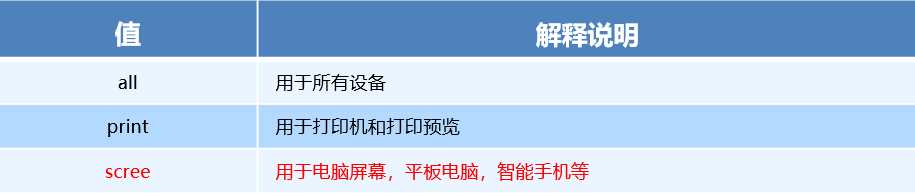

## HTML+CSS学习笔记 rem布局、媒体查询和less

---

### rem基础

#### rem单位

rem (root em)是一个相对单位，类似于em，em是父元素字体大小。

不同的是**rem的基准是相对于html元素的字体大小**。

比如，根元素（html）设置font-size=12px; 非根元素设置width:2rem; 则换成px表示就是24px。

```
/* 根html 为 12px */
html {
   font-size: 12px;
}
/* 此时 div 的字体大小就是 24px */       
div {
    font-size: 2rem;
}
```

rem的优势：父元素文字大小可能不一致， 但是整个页面只有一个html，可以很好来控制整个页面的元素大小。

### 媒体查询

#### 什么是媒体查询

媒体查询（Media Query）是CSS3新语法。

+ 使用 @media查询，可以针对不同的媒体类型定义不同的样式
+ @media 可以针对不同的屏幕尺寸设置不同的样式
+ 当你重置浏览器大小的过程中，页面也会根据浏览器的宽度和高度重新渲染页面 
+ 目前针对很多苹果手机、Android手机，平板等设备都用得到多媒体查询

#### 媒体查询语法规范

+ 用 @media开头 注意@符号
+ mediatype  媒体类型
+ 关键字 and  not  only
+ media feature 媒体特性必须有小括号包含

```
@media mediatype and|not|only (media feature) {
    CSS-Code;
}
```

1. mediatype 查询类型

​       将不同的终端设备划分成不同的类型，称为媒体类型



2. 关键字

​       关键字将媒体类型或多个媒体特性连接到一起做为媒体查询的条件。

+ and：可以将多个媒体特性连接到一起，相当于“且”的意思。
+ not：排除某个媒体类型，相当于“非”的意思，可以省略。
+ only：指定某个特定的媒体类型，可以省略。    

3. 媒体特性

   每种媒体类型都具体各自不同的特性，根据不同媒体类型的媒体特性设置不同的展示风格。我们暂且了解三个。

   注意他们要加小括号包含

   

   

4. 媒体查询书写规则

   注意： 为了防止混乱，媒体查询我们要按照从小到大或者从大到小的顺序来写,但是我们最喜欢的还是从小到大来写，这样代码更简洁

   

   

   

### less 基础

#### 维护css弊端

CSS 是一门非程序式语言，没有变量、函数、SCOPE（作用域）等概念。

+ CSS 需要书写大量看似没有逻辑的代码，CSS 冗余度是比较高的。
+ 不方便维护及扩展，不利于复用。
+ CSS 没有很好的计算能力
+ 非前端开发工程师来讲，往往会因为缺少 CSS 编写经验而很难写出组织良好且易于维护的 CSS 代码项目。 

#### Less 介绍 

Less（LeanerStyle Sheets 的缩写）是一门 CSS扩展语言，也成为CSS预处理器。

做为 CSS的一种形式的扩展，它并没有减少CSS的功能，而是在现有的CSS语法上，为CSS加入程序式语言的特性。

它在CSS 的语法基础之上，引入了变量，Mixin（混入），运算以及函数等功能，大大简化了 CSS 的编写，并且降低了 CSS的维护成本，就像它的名称所说的那样，Less可以让我们用更少的代码做更多的事情。

Less中文网址：[http://](http://lesscss.cn/)[less](http://lesscss.cn/)[css.cn/](http://lesscss.cn/)

常见的CSS预处理器：Sass、Less、Stylus

一句话：Less是一门 CSS 预处理语言，它扩展了CSS的动态特性。

Less安装

①安装nodejs，可选择版本(8.0)，网址：<http://nodejs.cn/download/>

②检查是否安装成功，使用cmd命令（win10是window+r 打开运行输入cmd）  ---输入“node –v”查看版本即可

③基于nodejs在线安装Less，使用cmd命令“npm install -g less”即可

④检查是否安装成功，使用cmd命令“ lessc -v ”查看版本即可

Less 使用之变量

变量是指没有固定的值，可以改变的。因为我们CSS中的一些颜色和数值等经常使用。

```
@变量名:值;
```

+ 必须有@为前缀
+ 不能包含特殊字符
+ 不能以数字开头
+ 大小写敏感

```
@color: pink;
```

Less 编译 vocode Less 插件

Easy LESS 插件用来把less文件编译为css文件

安装完毕插件，重新加载下 vscode。

只要保存一下Less文件，会自动生成CSS文件。


Less 嵌套

```
// 将css改为less
#header .logo {
  width: 300px;
}

#header {
    .logo {
       width: 300px;
    }
}

```

如果遇见 （交集|伪类|伪元素选择器） ，利用&进行连接

```
a:hover{
    color:red;
}
a{
  &:hover{
      color:red;
  }
}
```

Less 运算

任何数字、颜色或者变量都可以参与运算。就是Less提供了加（+）、减（-）、乘（*）、除（/）算术运算。

```
/*Less 里面写*/
@witdh: 10px + 5;
div {
    border: @witdh solid red;
}
/*生成的css*/
div {
  border: 15px solid red;
}
/*Less 甚至还可以这样 */
width: (@width + 5) * 2;

```

+ 乘号（*）和除号（/）的写法  
+ 运算符中间左右有个空格隔开 1px + 5
+ 对于两个不同的单位的值之间的运算，运算结果的值取第一个值的单位 
+ 如果两个值之间只有一个值有单位，则运算结果就取该单位

### rem适配方案

1.让一些不能等比自适应的元素，达到当设备尺寸发生改变的时候，等比例适配当前设备。

2.使用媒体查询根据不同设备按比例设置html的字体大小，然后页面元素使用rem做尺寸单位，当html字体大小变化元素尺寸也会发生变化，从而达到等比缩放的适配。

技术方案：

1.less+rem+媒体查询

2.lflexible.js+rem

总结： 

两种方案现在都存在。

方案2 更简单，现阶段大家无需了解里面的js代码。

---

#### [返回目录](./)


