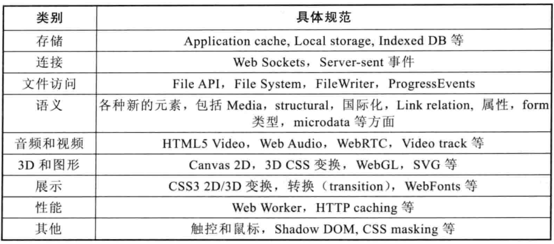

## HTML+CSS学习笔记 HTML5

---

HTML5包含了10个大的类别：离线（offline）、存储（storage）、链接（connectivity）、文件访问（file access）、语义（semantics）、音频和视频（audio/video）、3D和图形（3D/graphics）、展示（presentation）、性能（performance）和其他（Nuts and bolts）

---

#### [返回目录](./)

