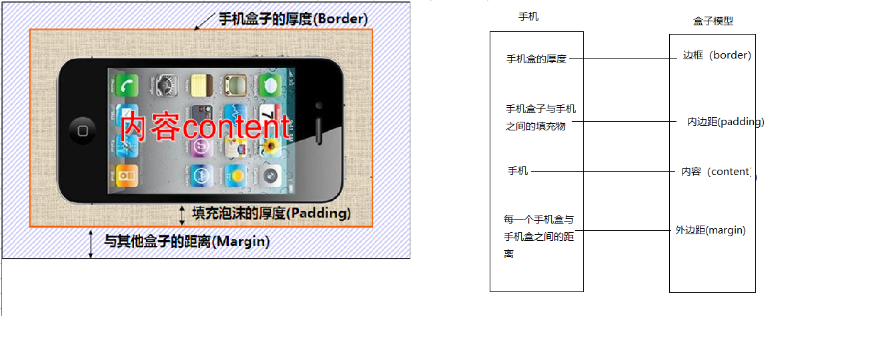

## HTML+CSS学习笔记 CSS盒子模型

---

### 1. 盒子模型

所谓盒子模型：

- 就是把HTML页面中的布局**元素**看作是一个矩形的**盒子**，也就是一个盛装内容的容器。

  

  

* 盒子模型有元素的内容、边框（border）、内边距（padding）、和外边距（margin）组成。
* 盒子里面的文字和图片等元素是 内容区域
* 盒子的厚度 我们成为 盒子的边框 
* 盒子内容与边框的距离是内边距（类似单元格的 cellpadding)
* 盒子与盒子之间的距离是外边距（类似单元格的 cellspacing）

---

### 2. 尺寸计算（重要）

计算公式为：

#### 一、默认情况下


**元素最终尺寸 = width/height + padding + border**


#### 二、box-sizing为 border-box 时

**元素最终尺寸 = width/height**
**内容尺寸 = width/height - padding - border**


---

### 3. 水平居中（可见前端面试问题 居中问题）

1. 盒子内的文字水平居中是  text-align: center,  而且还可以让 行内元素和行内块居中对齐

2. 块级盒子水平居中  左右margin 改为 auto 

   ```css
   text-align: center; /*  文字 行内元素 行内块元素水平居中 */
   margin: 10px auto;  /* 块级盒子水平居中  左右margin 改为 auto 就阔以了 上下margin都可以 */
   ```


---

### 4. 全局清除默认内外边距

为了更灵活方便地控制网页中的元素，制作网页时，我们需要将元素的默认内外边距清除

代码： 

~~~css
* {
   padding:0;         /* 清除内边距 */
   margin:0;          /* 清除外边距 */
}
~~~

注意：  

* 行内元素为了照顾兼容性， 尽量只设置左右内外边距， 不要设置上下内外边距。


---

### 5. 外边距合并

1. **相邻块元素垂直外边距的合并**

- 当上下相邻的两个块元素相遇时，如果上面的元素有下外边距margin-bottom

- 下面的元素有上外边距margin-top，则他们之间的垂直间距不是margin-bottom与margin-top之和

- **取两个值中的较大者**这种现象被称为相邻块元素垂直外边距的合并（也称外边距塌陷）。

  

  **解决方案：尽量给只给一个盒子添加margin值**。

2. **嵌套块元素垂直外边距的合并（塌陷）**

- 对于两个嵌套关系的块元素，**如果父元素没有上内边距及边框**

- 父元素的上外边距会与子元素的上外边距发生合并

- 合并后的外边距为两者中的较大者

  

  **解决方案：**

  1. 可以为父元素定义上边框。
  2. 可以为父元素定义上内边距
  3. 可以为父元素添加overflow:hidden。

  还有其他方法，比如浮动、固定、绝对定位的盒子（没有嵌套关系）不会有问题

---

### 6. 盒子模型布局稳定性

按照 优先使用  尺寸 （width/height）  其次 使用内边距（padding）    再次  外边距（margin）。   

```
  width/height >  padding  >   margin   
```

- 原因：
  - margin 会有外边距合并 还有 ie6下面margin 加倍的bug（讨厌）所以最后使用。
  - padding  会影响盒子大小， 需要进行加减计算（麻烦） 其次使用。
  - width/height   没有问题（嗨皮）我们经常使用宽度剩余法 高度剩余法来做。


---

#### [返回目录](./)

