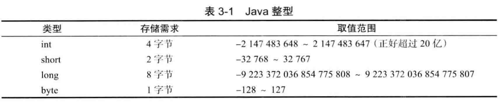
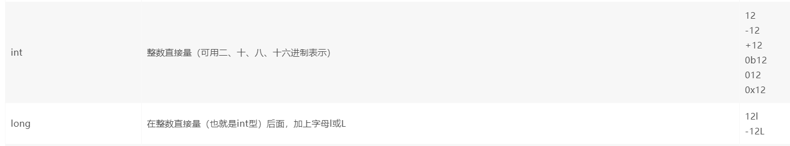
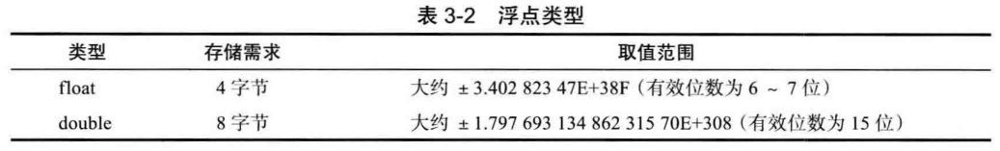
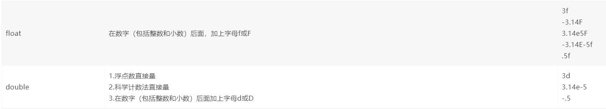
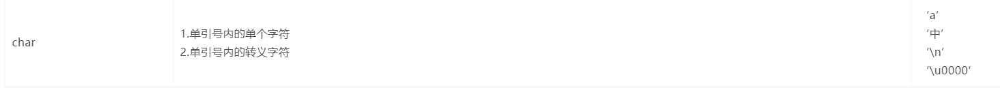
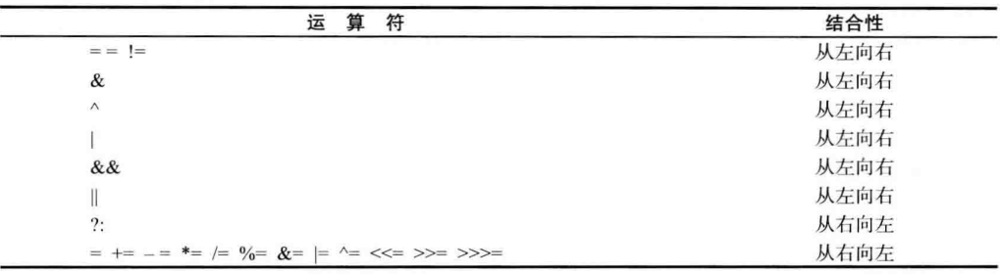

## Java学习笔记 基础语法
---
### 1. 基本数据类型

1. 整形  

+ 整型类型   
      

+ 整型字面量  
      
    注：二进制表示从Java7开始。  
    注：Java7开始，可以在数字字面量之间加入下划线，编译器最终会去除它们。  
    例如：  
    ```
    1_000_000
    ```
2. 浮点型  

+ 浮点类型  
      

+ 浮点型字面量  
      

3. 字符型

+ 字符类型  
    | 类型 | 存储要求 | 取值范围 |
    | :-----| :---- | :----: |
    | char  | 2字节 |   -   |

+ 字符字面量  
    

4. boolean型

+ boolean类型  
    | 类型 | 存储要求 | 取值范围 |
    | :-----| :---- | :----: |
    | boolean  | 具体虚拟机定义 |   true \| false   |

+ boolean字面量  
    true | false

---
### 2. 运算符  

  


---
### 3. 流程结构

+ 块作用域  
    不存在块作用域
+ 条件语句
    `if……else……`  
+ 循环语句
    `while`  
    `do……while`  
    `for`
+ 多重选择  
    `switch`


---

#### [返回目录](./)