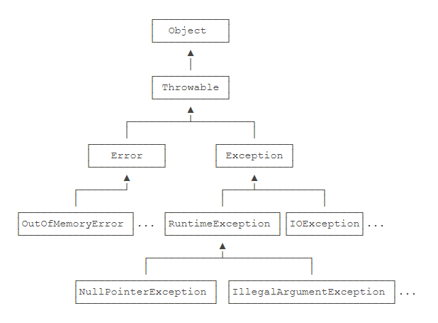

## Java学习笔记 异常
---
### 1. 异常分类  

  

1. Error系：严重错误，程序无能为力。
    + OutOfMemoryError：内存耗尽
    + NoClassDefFoundError：无法加载某个Class
    + StackOverflowError：栈溢出
2. Exception系：运行时可能出现的异常。
    + RuntimeException：程序代码本身的缺陷。
    + 其他异常：程序本身没有问题，环境因素影响。

根据这个分类，规定了检查机制：  

1. 受检查异常：必须捕获处理的异常，所有的其他异常和Exception本身。
2. 非受检查异常：不需要捕获处理的异常，Error系、RuntimeException。因为这些问题要么系统错误无法解决，要么程序本身错误，能够由程序员进行优化。

---
### 2. 抛出异常  

&emsp;&emsp;当运行过程中发生错误或者其他原因，可以创建并抛出一个异常。

1. 抛出内置异常：创建一个合适的异常对象，使用`throw`关键字抛出异常。
2. 抛出自定义异常：定义一个继承Exception或者Exception子类的异常类，在程序中创建它的对象并抛出。

---
### 3. 声明异常  

&emsp;&emsp;当方法内部抛出了异常，则可以在方法上声明异常，让调用该方法的程序来处理。声明方式：
```
Object function(……) throws Exception
{
    方法内容
}
```
---
### 4. 捕获异常 

&emsp;&emsp;抛出的异常需要进行捕获处理，如果没有进行捕获，程序会终止，并在控制台打印异常信息。使用`try/catch`块来捕获异常：
```
try(声明资源变量与对象，可用分号隔开)
{

}
catch(ExceptionType|ExceptionType2 e)
{
    异常处理代码
}
finally
{
    必定执行的代码
}
```

&emsp;&emsp;try块中一旦抛出异常，则会跳过try块里剩余的代码，执行异常处理代码。而finally里的代码，不管是否有异常发生，在最后都会执行。就算`try/catch`里有return语句，也会执行finally块。`try`后可跟资源对象，在try块结束时自动关闭对应资源。


---
#### [返回目录](./)
