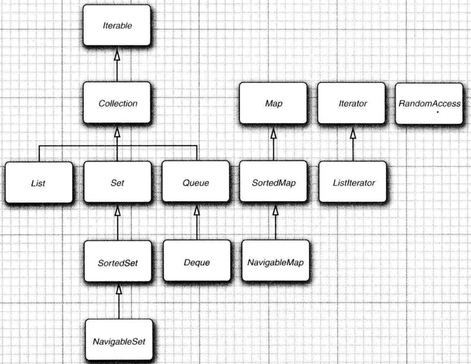
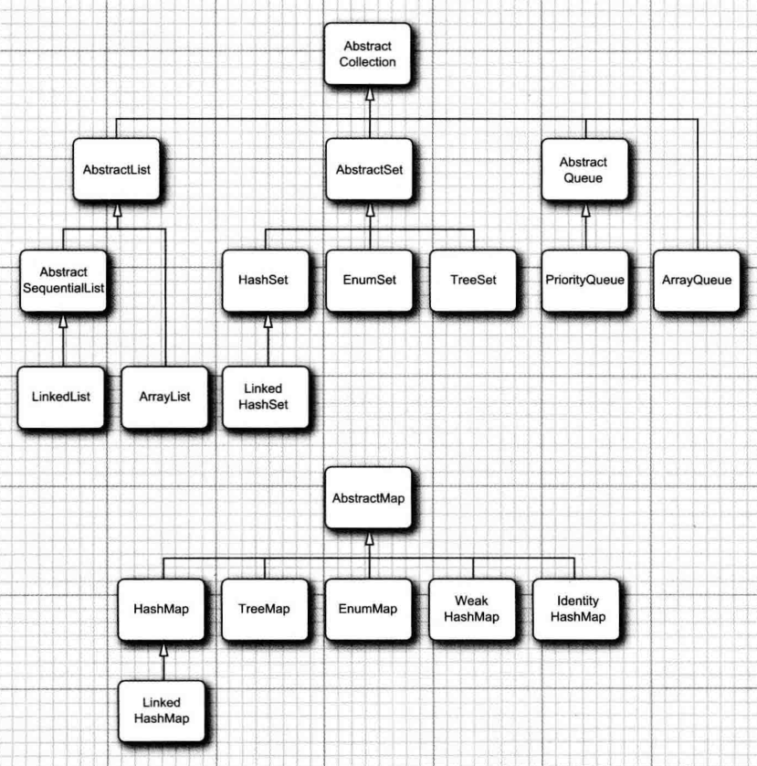
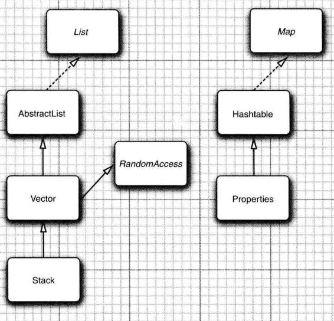
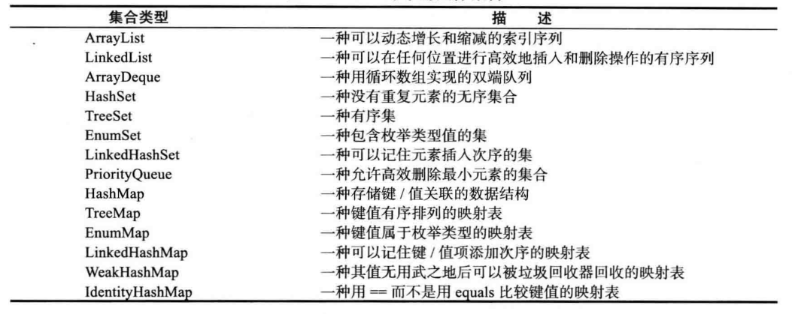

## Java学习笔记 集合
---
### 1. 集合接口/类 

集合接口：  

集合类：  

具体集合类描述：  

---
### 2. 迭代器  

Iterator是一种抽象的数据访问模型。使用Iterator模式进行迭代的好处有：

+ 对任何集合都采用同一种访问模型；
+ 调用者对集合内部结构一无所知；
+ 集合类返回的Iterator对象知道如何迭代。
+ Java提供了标准的迭代器模型，即集合类实现java.util.Iterable接口，返回java.util.Iterator实例。

---
### 3. 集合工具类 

Collections类提供了一组工具方法来方便使用集合类：

+ 创建空集合；
+ 创建单元素集合；
+ 创建不可变集合；
+ 排序／洗牌等操作。

---
#### [返回目录](./)
