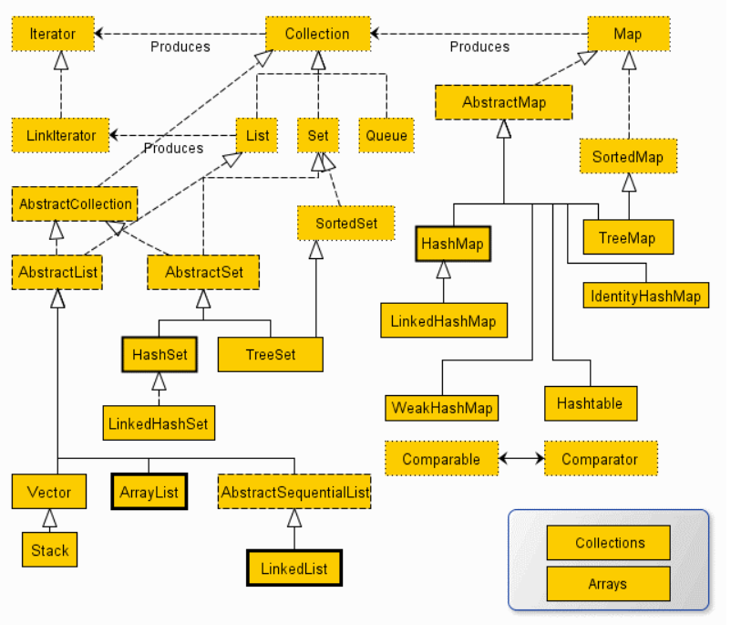

## Java学习笔记 集合
---
### 1. 集合接口/类 

---
### 2. Collection 接口

包含的方法：
+ int size();
+ boolean isEmpty();
+ void clear();
+ boolean contains(T x);
+ boolean add(T x);
+ boolean remove(T x);
+ Iterator\<T> iterator(); 

---
### 3. Iterator 接口

包含的方法：
+ boolean hasNext();
+ T next();
+ void remove();

---
### 4. ListIterator 接口

包含的方法：
+ boolean hasPrevious();
+ T previous();
+ void add(T x);
+ void set(T newV);

---
### 5. List 接口 

包含的方法：
+ T get(int inx);
+ T set(int inx,T newV);
+ void add(int inx,T x);
+ T remove(int inx);
+ ListIterator\<T> listIterator(int pos)

在List中查找元素时，List的实现类通过元素的equals()方法比较两个元素是否相等，因此，放入的元素必须正确覆写equals()方法，Java标准库提供的String、Integer等已经覆写了equals()方法；

编写equals()方法可借助Objects.equals()判断。

如果不在List中查找元素，就不必覆写equals()方法。

---
### 6. ArrayList 类 与 LinkedList 类

+ 在末尾添加一个元素：`void add(E e)`
+ 在指定索引添加一个元素：`void add(int index, E e)`
+ 删除指定索引的元素：`int remove(int index)`
+ 删除某个元素：`int remove(Object e)`
+ 获取指定索引的元素：`E get(int index)`
+ 获取链表大小（包含元素的个数）：`int size()`

|  | ArrayList | LinkedList |
| :-----| :---- | :----: |
| 获取指定元素 | 速度很快 | 需要从头开始查找元素 |
| 添加元素到末尾 | 速度很快 | 速度很快 |
| 在指定位置添加/删除 | 需要移动元素 | 不需要移动元素 |
| 内存占用 | 少 | 较大 |

---
### 7. Stack 类 

栈（Stack）是一种后进先出（LIFO）的数据结构，操作栈的元素的方法有：

+ 把元素压栈：push(E)；
+ 把栈顶的元素“弹出”：pop(E)；
+ 取栈顶元素但不弹出：peek(E)。

在Java中，我们用Deque可以实现Stack的功能，注意只调用push()/pop()/peek()方法，避免调用Deque的其他方法。

最后，不要使用遗留类Stack。

---
### 8. Queue 接口

在Java的标准库中，队列接口Queue定义了以下几个方法：

+ int size()：获取队列长度；
+ boolean add(E)/boolean offer(E)：添加元素到队尾；
+ E remove()/E poll()：获取队首元素并从队列中删除；
+ E element()/E peek()：获取队首元素但并不从队列中删除。

要避免把null添加到队列。

---
### 9. Deque 接口

Java集合提供了接口Deque来实现一个双端队列，它的功能是：

+ 既可以添加到队尾，也可以添加到队首；
+ 既可以从队首获取，又可以从队尾获取。

包含方法：
+ 将元素添加到队尾或队首：addLast()/offerLast()/addFirst()/offerFirst()；
+ 从队首／队尾获取元素并删除：removeFirst()/pollFirst()/removeLast()/pollLast()；
+ 从队首／队尾获取元素但不删除：getFirst()/peekFirst()/getLast()/peekLast()；
+ 总是调用xxxFirst()/xxxLast()以便与Queue的方法区分开；

避免把null添加到队列。

---
### 10. PriorityQueue 类

PriorityQueue实现了一个优先队列：从队首获取元素时，总是获取优先级最高的元素。

PriorityQueue默认按元素比较的顺序排序（必须实现Comparable接口），也可以通过Comparator自定义排序算法（元素就不必实现Comparable接口）。

---
### 11. Set 接口

Set用于存储不重复的元素集合，它主要提供以下几个方法：

+ 将元素添加进Set：boolean add(E e)
+ 将元素从Set删除：boolean remove(Object e)
+ 判断是否包含元素：boolean contains(Object e)

---
### 12. SortedSet 接口  

保证元素的有序性，元素需要实现`Comparable`接口

---
### 13. TreeSet 类

添加的元素必须正确实现Comparable接口，如果没有实现Comparable接口，那么创建TreeSet时必须传入一个Comparator对象

---
### 14. HashSet 类

要正确实现equals()和hashCode()方法，否则该元素无法正确地放入HashSet。

---
### 15. Map 接口

Map是一种映射表，可以通过key快速查找value。

包含方法：
+ void clear( )
+ boolean containsKey(Object k)
+ boolean containsValue(Object v)
+ Set entrySet( )
+ boolean equals(Object obj)
+ Object get(Object k)
+ int hashCode( )
+ boolean isEmpty( )
+ Set keySet( )
+ Object put(Object k, Object v)
+ void putAll(Map m)
+ Object remove(Object k)
+ int size( )
+ Collection values( )

---
### 16. HashMap 类

Java7 使用 数组+链表的方式

Java8 使用 数组+链表/红黑树

---
### 17. TreeMap 类

红黑树

---
### 18. 集合工具类 

Collections类提供了一组工具方法来方便使用集合类：

+ 创建空集合；
+ 创建单元素集合；
+ 创建不可变集合；
+ 排序／洗牌等操作。

---
#### [返回目录](./)
