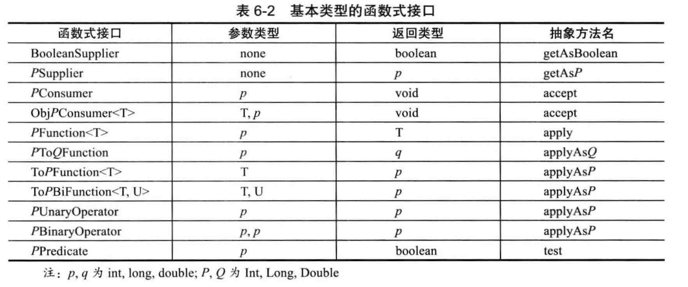

## Java学习笔记 常用内置接口
---
### 1. 比较接口

| 接口 | 说明 | 方法 |
| :-----| :---- | :----: |
| Comparable | 实现该接口可以进行比较 | 参考API文档 |
| Comparator | 比较器接口 | 参考API文档 |

---
### 2. 克隆接口
| 接口 | 说明 | 方法 |
| :-----| :---- | :----: |
| Clonebale | 实现该接口可使用克隆 | 标记接口 |

---
### 3. 常用函数式接口

如果是基础数据类型，可以使用下面的基础类型函数式接口：

---
#### [返回目录](./)
