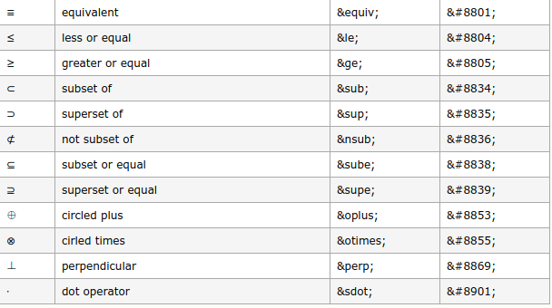

## MarkDown学习笔记 HTML与特殊字符
---
### 1.兼容HTML

&emsp;&emsp;不在 Markdown 涵盖范围之内的标签，都可以直接在文档里面用 HTML 撰写。不需要额外标注这是 HTML 或是 Markdown；只要直接加标签就可以了。

---
### 2.特殊字符转换

&emsp;&emsp;在HTML中的一些特殊符号，如< 和 & 需要使用转义，但是在MarkDown中可以直接写这个符号，会自动转义，但是一些不可写特殊符号就不行，比如空格符号，还是需要写转义符号。下面给出html的特殊符号对应表。

参考地址：[http://www.w3school.com.cn/tags/html_ref_symbols.html](http://www.w3school.com.cn/tags/html_ref_symbols.html)

---
#### [返回目录](./)
