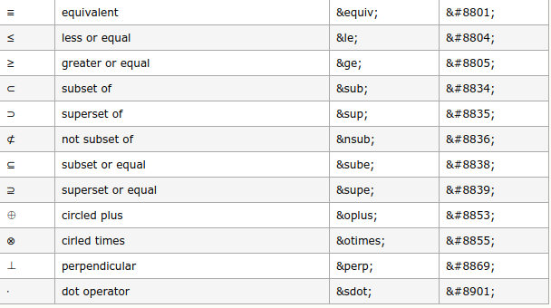

## MarkDown学习笔记 区段元素
---
### 1.链接

&emsp;&emsp;链接有两种表示方式：行内和参考式。  
&emsp;&emsp;行内式只要在方块括号后面紧接着圆括号并插入网址链接即可，如果你还想要加上链接的 title 文字，只要在网址后面，用双引号把 title 文字包起来即可。例如：
```
This is [an example](http://example.com/ "Title") inline link.

[This link](http://example.net/) has no title attribute.
```
This is [an example](http://example.com/ "Title") inline link.

[This link](http://example.net/) has no title attribute.

&emsp;&emsp;参考式的链接是在链接文字的括号后面再接上另一个方括号，而在第二个方括号里面要填入用以辨识链接的标记，接着，在文件的任意处，你可以把这个标记的链接内容定义出来，例如：
```
I get 10 times more traffic from [Google][1] than from [Yahoo][2] or [MSN][3].

  [1]: http://google.com/        "Google"
  [2]: http://search.yahoo.com/  "Yahoo Search"
  [3]: http://search.msn.com/    "MSN Search"
```
I get 10 times more traffic from [Google][1] than from [Yahoo][2] or [MSN][3].

  [1]: http://google.com/        "Google"
  [2]: http://search.yahoo.com/  "Yahoo Search"
  [3]: http://search.msn.com/    "MSN Search"

---
### 2.强调

&emsp;&emsp;用星号（ * ）和底线（ _ ）作为标记强调字词的符号，被 * 或 _ 包围的字词会被转成用 &lt;em> 标签包围，显示斜体。用两个 * 或 _ 包起来的话，则会被转成 &lt;strong>，显示粗体。用三个 * 或 _ 包起来的话，则会显示粗斜体。例如：
```
*single asterisks*

_single underscores_

**double asterisks**

__double underscores__

***three asterisks***

___three underscores___

```
*single asterisks*

_single underscores_

**double asterisks**

__double underscores__

***three asterisks***

___three underscores___

---
### 3.删除线

&emsp;&emsp;两端加上两个波浪线 `~~` 就可以给文字加上删除线，例如：
```
~~This is delete~~
```
~~This is delete~~

---
### 4.代码

&emsp;&emsp;一行内的代码使用单个反引号包围起来，可以使用3个以上反引号包围，形成代码区段。例如：
```
Use the `printf()` function.
```There is a literal backtick (`) here.```
```
Use the `printf()` function.
```
There is a literal backtick (`) here.  
```

---
### 5.图片

&emsp;&emsp;使用一种和链接很相似的语法来标记图片，同样也允许两种样式： 行内式和参考式，只需要在链接的格式前面加上一个!号。例如：
```

```


---
### 6.反斜杠（转义）

&emsp;&emsp;以利用反斜杠来插入一些在语法中有其它意义的符号。例如：
```
\*literal asterisks\*
```
\*literal asterisks\*

---
### 7.自动链接

&emsp;&emsp;只要是用方括号包起来，就会自动把它转成链接，包括邮箱地址。例如：
```
<http://example.com/>
<admin@ruixiaozi.com>
```
<http://example.com/>  
<admin@ruixiaozi.com>

---
### 8.公式

&emsp;&emsp;插入数学公式时，可以使用两个美元符 $$ 包裹 TeX 或 LaTeX 格式的数学公式来实现（注：需要前端渲染支持MathJax）。如下：
```
$$
\mathbf{V}_1 \times \mathbf{V}_2 =  \begin{vmatrix} 
\mathbf{i} & \mathbf{j} & \mathbf{k} \\
\frac{\partial X}{\partial u} &  \frac{\partial Y}{\partial u} & 0 \\
\frac{\partial X}{\partial v} &  \frac{\partial Y}{\partial v} & 0 \\
\end{vmatrix}
$$tep1}{\style{visibility:hidden}{(x+1)(x+1)}}
$$
```
$$
\mathbf{V}_1 \times \mathbf{V}_2 =  \begin{vmatrix} 
\mathbf{i} & \mathbf{j} & \mathbf{k} \\
\frac{\partial X}{\partial u} &  \frac{\partial Y}{\partial u} & 0 \\
\frac{\partial X}{\partial v} &  \frac{\partial Y}{\partial v} & 0 \\
\end{vmatrix}
$$tep1}{\style{visibility:hidden}{(x+1)(x+1)}}
$$


---
#### [返回目录](./)
