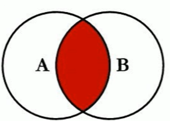
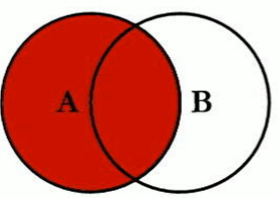
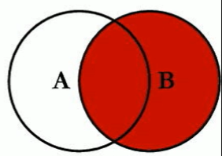
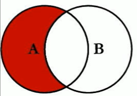
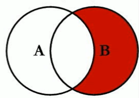
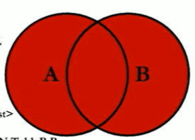
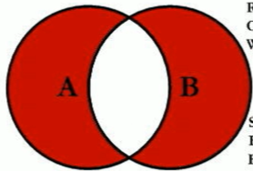

## MySQL高级学习笔记 7种join
---
### 1. 理论与实现

1. 内连接（共有部分，必须满足on）  

       

    ```
    select * from A inner join B on A.key = B.key;
    ```

2. 左外链接（左边独有+共有，满足on的+A中独有的在B补NULL）

      
    
    ```
    select * from A left outer join B on A.key = B.key;
    ```

3. 右外连接（右边独有+共有，满足on的+B中独有的在A补NULL）

    

    ```
    select * from A right outer join B on A.key = B.key;
    ```

4. A独有（A中不满足On条件的）

      

    ```
    select * from A left outer join B on A.key = B.key 
            where B.key is NULL;
    ```

5. B独有（B中不满足On条件的）

      

    ```
    select * from A right outer join B on A.key = B.key 
            where A.key is NULL;
    ```

6. 全链接（共有+各自独有，满足on条件，各自不满足的，另一方补NULL）

      

    ```
    select * from A left outer join B on A.key = B.key 
    union
    select * from A right outer join B on A.key = B.key;
    ```

7. 独有链接（各自独有，各自不满足的，另一方补NULL）

      

    ```
    select * from A left outer join B on A.key = B.key 
            where B.key is NULL
    union
    select * from A right outer join B on A.key = B.key
            where A.key is NULL;
    ```

---

#### [返回目录](./)
