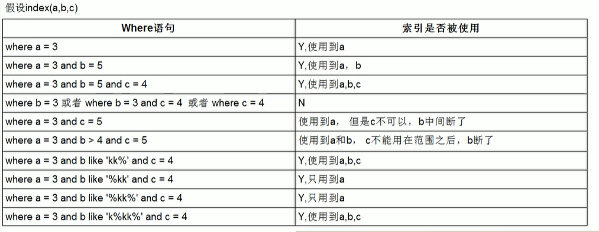

## MySQL高级学习笔记 索引优化
---
### 1. 单表查询

&emsp;&emsp;可以通过 `explain` 来分析，如果出现不好的情况，可以尝试重建适合的索引，比如增加或者减少字段创建复合索引。

---
### 2. 两表链接查询 

&emsp;&emsp;可以通过 `explain` 来分析，如果出现不好的情况。左链接在右表加索引，右链接在左表加索引。也可以改变左右链接表的位置。

---
### 3. 三表查询

&emsp;&emsp;可能出现 `join buffer` ，同样适用于两表的优化规则，加索引。总得来说：索引建立在经常查询的字段。

---
### 4. Join优化

+ 小结果集驱动大结果集
+ Join语句被驱动表上的Join条件字段已经被索引
+ 设置joinbuffer值大一点

---
### 5. 索引失效 

&emsp;&emsp;已经建立的索引，但是通过 `explain` 分析，没有被实际用到。

违反了以下规则，就会出现索引失效：

1. 最佳左前缀法则：索引第一个字段必须用到，且查询不跳过索引的中间字段。**也就是说索引中哪个字段没用到，那么索引中没用到的字段以及后面字段就不会被索引，与查询语句中字段出现的顺序无关**。
2. 范围查询也会中断索引，范围查询之后的字段不会被索引。
2. 全值匹配：索引与查询字段全部匹配。
3. 尽量不要在索引列上做任何操作（计算、函数、类型转换）
4. 尽量使用覆盖索引（只读取索引的列）
5. 使用不等于的时候，无法使用索引
6. is null，is not null也无法使用索引
7. like以通配符开头，也无法使用索引
8. 字符串不加单引号，造成类型转换，也会索引失效
9. 少用or，用or会造成索引失效

例子：

---

#### [返回目录](./)
