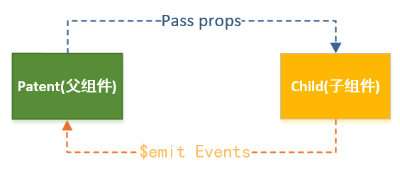

## Vue全家桶学习笔记 Vue组件
---
### 1. 基本使用

#### 1.1 注册组件  

+ 全局注册      
    ```
    Vue.component('name',{
        template:'xxx',
        ......
    })
    ```
    
    **全局注册**就是说它们在注册之后可以用在任何新创建的 Vue 根实例 (`new Vue`) 的模板中以及子组件中。
    
    **全局注册的行为必须在根 Vue 实例 (通过 `new Vue`) 创建之前发生**
    
+ 局部注册  
    ```
    new Vue({
        ......
        components:{
            'name':{
               template:'xxx',
               ...... 
            }
        }
        ......
    })
    ```

    **局部注册的组件只在当前组件的模板中可用，在其子组件中不可用**

其中name可以有两种形式：

1. **使用 kebab-case**（短横线分隔）

   ```
   Vue.component('my-component-name', { /* ... */ })
   ```

   当使用 kebab-case (短横线分隔命名) 定义一个组件时，你也必须在引用这个自定义元素时使用 kebab-case，例如 `<my-component-name>`。

2. **使用 PascalCase**(帕斯卡、大驼峰)

   ```
   Vue.component('MyComponentName', { /* ... */ })
   ```

   当使用 PascalCase (首字母大写命名) 定义一个组件时，你在引用这个自定义元素时两种命名法都可以使用。也就是说 `<my-component-name>` 和 `<MyComponentName>` 都是可接受的。注意，尽管如此，直接在 DOM (即非字符串的模板) 中使用时只有 kebab-case 是有效的。

#### 1.2 组件的data  

+ 组件对象也有一个data属性(也可以有methods等属性，下面我们有用到)
+ 只是这个data属性必须是一个函数
+ 而且这个函数返回一个对象，对象内部保存着数据
```
components:{
    'name':{
        template:'xxx',
        data(){
            return {
                ......
            }
        } 
    }
}
```

---
### 2. 父子组件通信  



#### 2.1 父组件向子组件传递参数（props）

**所有的 prop 都使得其父子 prop 之间形成了一个单向下行绑定：父级 prop 的更新会向下流动到子组件中，但是反过来则不行。**这样会防止从子组件意外变更父级组件的状态，从而导致你的应用的数据流向难以理解。

额外的，每次父级组件发生变更时，子组件中所有的 prop 都将会刷新为最新的值。**这意味着你不应该在一个子组件内部改变 prop。如果你这样做了，Vue 会在浏览器的控制台中发出警告。**

可以用data属性来保存这个初始值prop：

```
props: ['initialCounter'],
data: function () {
  return {
    counter: this.initialCounter
  }
}
```

如果要进行处理，也可以使用计算属性：

```
props: ['size'],
computed: {
  normalizedSize: function () {
    return this.size.trim().toLowerCase()
  }
}
```

HTML 中的 attribute 名是大小写不敏感的，所以浏览器会把所有大写字符解释为小写字符。这意味着当你使用 DOM 中的模板时，camelCase (驼峰命名法) 的 prop 名需要使用其等价的 kebab-case (短横线分隔命名) 命名：

```
Vue.component('blog-post', {
  // 在 JavaScript 中是 camelCase 的
  props: ['postTitle'],
  template: '<h3>{{ postTitle }}</h3>'
})
<!-- 在 HTML 中是 kebab-case 的 -->
<blog-post post-title="hello!"></blog-post>
```

+ 方式一：字符串数组，数组中的字符串就是传递时的名称。
    ```
    components:{
        'name':{
            template:'xxx',
            props:['aaa','bbb']
        }
    }
    
    <name :aaa="" :bbb=""></name>
    <!-- 该 prop 没有值的情况，意味着 `true`。-->
    <blog-post is-published></blog-post>
    //is-published == true
    ```
+ 方式二：对象，对象可以设置传递时的类型，也可以设置默认值等。
    ```
    components:{
        'name':{
            template:'xxx',
            props:{ //大括号代表对象
                aaa:类型,	//单种类型
                bbb:[类型1,类型2,...], //多种类型
                ccc:{
                    type:类型,
                    required:true|false,
                    defalut:默认值|（对象和数组类型的props默认值必须是一个工厂函数，返回对象或数组）
                },
                ddd:{
                    //自定义验证（会在实例创建之前执行验证，vue实例的所有属性都不可用）
                    validator:function(value){
                        return true|false;
                    }
                }
            }
        }
    }
    //类型可以是以下：
    String
    Number
    Boolean
    Array
    Object
    Date
    Function
    Symbol
    构造函数
    自定义class
    ```

#### 2.2 非 Prop 的 Attribute

一个非 prop 的 attribute 是指传向一个组件，但是该组件并没有相应 prop 定义的 attribute。这些 attribute 会被添加到这个组件的根元素上。

+ 替换/合并 Attribute

  外部提供给组件的值会替换掉组件内部设置好的值，`class` 和 `style` attribute 会稍微智能一些，即两边的值会被合并起来，从而得到最终的值。

+ 禁用 Attribute 继承

  如果你**不**希望组件的根元素继承 attribute，你可以在组件的选项中设置 `inheritAttrs: false`，(`inheritAttrs: false` 选项**不会**影响 `style` 和 `class` 的绑定)，配合实例的 `$attrs` property 使用，该 property 包含了传递给一个组件的 attribute 名和 attribute 值。下面这样可以把attribute继承到**非根元素**上：

  ```
  Vue.component('base-input', {
    inheritAttrs: false,
    props: ['label', 'value'],
    template: `
      <label>
        {{ label }}
        <input
          v-bind="$attrs"
          v-bind:value="value"
          v-on:input="$emit('input', $event.target.value)"
        >
      </label>
    `
  })
  ```


#### 2.3 子组件向父组件传递事件（$emit）  

+ 在子组件函数中，调用`this.&emit('事件名',参数...)`，发送一个自定义事件。

  + 事件名：

    不同于组件和 prop，事件名不会被用作一个 JavaScript 变量名或 property 名，所以就没有理由使用 camelCase 或 PascalCase 了。并且 `v-on` 事件监听器在 DOM 模板中会被自动转换为全小写 (因为 HTML 是大小写不敏感的)，所以 `v-on:myEvent` 将会变成 `v-on:myevent`——导致 `myEvent` 不可能被监听到。推荐你**始终使用 kebab-case 的事件名**。

+ 在父组件中，通过v-on来监听子组件事件。

#### 2.4 原生事件绑定到自定义组件

你可能有很多次想要在一个组件的根元素上直接监听一个原生事件。这时，你可以使用 `v-on` 的 `.native` 修饰符：

```
<base-input v-on:focus.native="onFocus"></base-input>
```

在有的时候这是很有用的，不过在你尝试监听一个类似 `<input>` 的非常特定的元素时，这并不是个好主意。比如上述 `<base-input>` 组件可能做了如下重构，所以根元素实际上是一个 `<label>` 元素：

```
<label>
  {{ label }}
  <input
    v-bind="$attrs"
    v-bind:value="value"
    v-on:input="$emit('input', $event.target.value)"
  >
</label>
```

这时，父级的 `.native` 监听器将静默失败。它不会产生任何报错，但是 `onFocus` 处理函数不会如你预期地被调用。

为了解决这个问题，**Vue 提供了一个 `$listeners` property**，它是一个对象，**里面包含了作用在这个组件上的所有监听器**。例如：

```
{
  focus: function (event) { /* ... */ }
  input: function (value) { /* ... */ },
}
```

有了这个 `$listeners` property，你就可以配合 `v-on="$listeners"` 将所有的事件监听器指向这个组件的某个特定的子元素。对于类似 `<input>` 的你希望它也可以配合 `v-model` 工作的组件来说，为这些监听器创建一个类似下述 `inputListeners` 的计算属性通常是非常有用的：

```
Vue.component('base-input', {
  inheritAttrs: false,
  props: ['label', 'value'],
  computed: {
    inputListeners: function () {
      var vm = this
      // `Object.assign` 将所有的对象合并为一个新对象
      return Object.assign({},
        // 我们从父级添加所有的监听器
        this.$listeners,
        // 然后我们添加自定义监听器，
        // 或覆写一些监听器的行为
        {
          // 这里确保组件配合 `v-model` 的工作
          input: function (event) {
            vm.$emit('input', event.target.value)
          }
        }
      )
    }
  },
  template: `
    <label>
      {{ label }}
      <input
        v-bind="$attrs"
        v-bind:value="value"
        v-on="inputListeners"
      >
    </label>
  `
})
```


#### 2.5 双向绑定（v-model）

一个组件上的 `v-model` **默认会利用名为 `value` 的 prop 和名为 `input` 的事件**，但是像单选框、复选框等类型的输入控件可能会将 `value` attribute 用于不同的目的。`model` 选项可以用来避免这样的冲突：

```
Vue.component('base-checkbox', {
  model: {
    prop: 'checked',
    event: 'change'
  },
  props: {
    checked: Boolean
  },
  template: `
    <input
      type="checkbox"
      v-bind:checked="checked"
      v-on:change="$emit('change', $event.target.checked)"
    >
  `
})
```

#### 2.6 多个双向绑定值（.sync）

类似于v-model，是 `prop` 和 `update:prop`事件的语法糖：

```
<text-document
  v-bind:title="doc.title"
  v-on:update:title="doc.title = $event"
></text-document>

//等价于下面
<text-document v-bind:title.sync="doc.title"></text-document>
```

当我们用一个对象同时设置多个 prop 的时候，也可以将这个 `.sync` 修饰符和 `v-bind` 配合使用：

```
<text-document v-bind.sync="doc"></text-document>
```

这样会把 `doc` 对象中的每一个 property (如 `title`) 都作为一个独立的 prop 传进去，然后各自添加用于更新的 `v-on` 监听器。

---
### 3. 父子组件访问 

1. 父组件访问子组件（$children,$refs）

    + $children：数组类型，它包含所有子组件对象。
    + $resfs：
        + $refs和ref指令通常是一起使用的。
        + 首先，我们通过ref给某一个子组件绑定一个特定的ID。
        + 其次，通过this.$refs.ID就可以访问到该组件了。
        ```
        <name ref="xx"></name>
        
        new Vue({
            ......
            methods:{
                test(){
                    this.$refs.xx;
                }
            }
            ......
        })
        ```
2. 子组件访问父组件（$parent）  
    尽管在Vue开发中，我们允许通过$parent来访问父组件，但是在真实开发中尽量不要这样做。

---
### 4. 插槽（slot）  
预留一个位置给使用组件时，自定义html代码。

#### 4.1 基本用法   

+ `<slot>`中的内容表示，如果没有在该组件中插入任何其他内容，就默认显示该内容
+ **插槽内的模板插值的作用域是当前模板代码所在组件作用于**
```
<template id="xx">
    <slot>...默认内容...</slot>
</template>

<name>
    <h1>我是插槽内容</h1>
    //或者用默认插槽
    <template v-slot:default>
    	<h1>我是插槽内容</h1>
    </template>
</name>
```

#### 4.2 带名字的插槽 (具名插槽)  

+ 给slot元素一个name属性，再使用的时候，在需要替换的html标签上加上`slot`属性(v-slot 2.6.0)，指明替换的slot。
```
<template id="xx">
    <slot name="a">...默认内容...</slot>
    <slot name="b">...默认内容...</slot>
</template>

<name>
    <h1 slot="a">我是插槽内容</h1>
    //2.6.0开始用v-slot
    //注意 v-slot 只能添加在 <template> 上 (只有一种例外情况)，这一点和已经废弃的 slot attribute 不同。
    <template v-slot:a>
    	<h1>我是插槽内容</h1>
    </template>
</name>
```

跟 `v-on` 和 `v-bind` 一样，`v-slot` 也有缩写，即把参数之前的所有内容 (`v-slot:`) 替换为字符`#`。例如 `v-slot:header` 可以被重写为 `#header`,**和其它指令一样，该缩写只在其有参数的时候才可用**：

```
<base-layout>
  <template #header>
    <h1>Here might be a page title</h1>
  </template>

  <p>A paragraph for the main content.</p>
  <p>And another one.</p>

  <template #footer>
    <p>Here's some contact info</p>
  </template>
</base-layout>
```

#### 4.3 作用域插槽   

**访问子组件中才有的数据**

用法：

+ 在插槽上绑定一个`自定义属性`，暴露给外部
    ```
    <template id="xx">
        <slot :data="mydata" :data2="mydata2">...默认内容...</slot>
    </template>
    ```
    
+ 在插入html时，使用`<template slot-scope="对象名称">` 或者 使用**带值**的 `v-slot` 来把插槽暴露的属性绑定到`对象名称`对象中。
    ```
    <name>
        <template slot-scope="slotObj">
            <span v-for="item in slotObj.data1">{{item}}</span>
        </template>
        //或者
        <template v-slot:default="slotProps">
            <span v-for="item in slotProps.data1">{{item}}</span>
        </template>
    </name>
    ```
    
    如果只有默认插槽，则可以直接写在组件名上：
    
    ```
    <name v-slot="slotProps">
        <span v-for="item in slotProps.data1">{{item}}</span>
    </name>
    ```

作用域插槽的内部工作原理是将你的插槽内容包裹在一个拥有单个参数的函数里：

```
function (slotProps) {
  // 插槽内容
}
```

这意味着 `v-slot` 的值实际上可以是任何能够作为函数定义中的参数的 JavaScript 表达式，可以使用 ES2015 解构来传入具体的插槽 prop，如下：

```
<current-user v-slot="{ user }">
  {{ user.firstName }}
</current-user>
```

这样可以使模板更简洁，尤其是在该插槽提供了多个 prop 的时候。它同样开启了 prop 重命名等其它可能，例如将 `user` 重命名为 `person`：

```
<current-user v-slot="{ user: person }">
  {{ person.firstName }}
</current-user>
```

你甚至可以定义后备内容，用于插槽 prop 是 undefined 的情形：

```
<current-user v-slot="{ user = { firstName: 'Guest' } }">
  {{ user.firstName }}
</current-user>
```

#### 4.4 动态插槽名

(2.6.0)动态指令参数也可以用在 `v-slot` 上，来定义动态的插槽名：

```
<base-layout>
  <template v-slot:[dynamicSlotName]>
    ...
  </template>
</base-layout>
```

---

### 5. 动态组件（组件切换）

有的时候，在不同组件之间进行动态切换是非常有用的，比如在一个多标签的界面里。

可以通过 Vue 的 `<component>` 元素加一个特殊的 `is` attribute 来实现：

```
<!-- 组件会在 `currentTabComponent` 改变时改变 -->
<component v-bind:is="currentTabComponent"></component>
```

在上述示例中，`currentTabComponent` 可以包括

- 已注册组件的名字，或
- 一个组件的选项对象

请留意，这个 attribute 可以用于**常规 HTML 元素**，但这些元素将被视为组件，这意味着所有的 attribute **都会作为 DOM attribute 被绑定**（即直接绑定到dom的属性上，而不是property）。对于像 `value` 这样的 property，若想让其如预期般工作，**你需要使用 `.prop` 修饰器**：

```
<h1 :is="currentTabComponent" :value.prop="v"></h1>
```

#### 5.1 缓存

那些标签的组件实例能够被在它们第一次被创建的时候缓存下来。为了解决这个问题，我们可以用一个 `<keep-alive>` 元素将其动态组件包裹起来。

```
<!-- 失活的组件将会被缓存！-->
<keep-alive>
  <component v-bind:is="currentTabComponent"></component>
</keep-alive>
```

**注意这个 `<keep-alive>` 要求被切换到的组件都有自己的名字，不论是通过组件的 `name` 选项还是局部/全局注册。**

### 6. 异步组件

在大型应用中，我们可能需要将应用分割成小一些的代码块，并且只在需要的时候才从服务器加载一个模块。为了简化，**Vue 允许你以一个工厂函数的方式定义你的组件，这个工厂函数会异步解析你的组件定义。Vue 只有在这个组件需要被渲染的时候才会触发该工厂函数，且会把结果缓存起来供未来重渲染**。例如：

```
Vue.component('async-example', function (resolve, reject) {
  setTimeout(function () {
    // 向 `resolve` 回调传递组件定义
    resolve({
      template: '<div>I am async!</div>'
    })
  }, 1000)
})
```

这个工厂函数会收到一个 `resolve` 回调，这个回调函数会在你从服务器得到组件定义的时候被调用。也可以调用 `reject(reason)` 来表示加载失败。**一个推荐的做法是将异步组件和 webpack 的 code-splitting 功能一起配合使用：**

```
Vue.component('async-webpack-example', function (resolve) {
  // 这个特殊的 `require` 语法将会告诉 webpack
  // 自动将你的构建代码切割成多个包，这些包
  // 会通过 Ajax 请求加载
  require(['./my-async-component'], resolve)
})
```

**也可以在工厂函数中返回一个 `Promise`，所以把 webpack 2 和 ES2015 语法加在一起，可以这样使用动态导入**：

```
Vue.component(
  'async-webpack-example',
  // 这个动态导入会返回一个 `Promise` 对象。
  () => import('./my-async-component')
)
```

当使用局部注册的时候，也可以直接提供一个返回 `Promise` 的函数：

```
new Vue({
  // ...
  components: {
    'my-component': () => import('./my-async-component')
  }
})
```

#### 6.1 异步加载的更详细处理方式

异步组件**工厂函数**也可以返回一个如下格式的对象：

```
const AsyncComponent = () => ({
  // 需要加载的组件 (应该是一个 `Promise` 对象)
  component: import('./MyComponent.vue'),
  // 异步组件加载时使用的组件
  loading: LoadingComponent,
  // 加载失败时使用的组件
  error: ErrorComponent,
  // 展示加载时组件的延时时间。默认值是 200 (毫秒)
  delay: 200,
  // 如果提供了超时时间且组件加载也超时了，
  // 则使用加载失败时使用的组件。默认值是：`Infinity`
  timeout: 3000
})
```

---

#### [返回目录](./)
