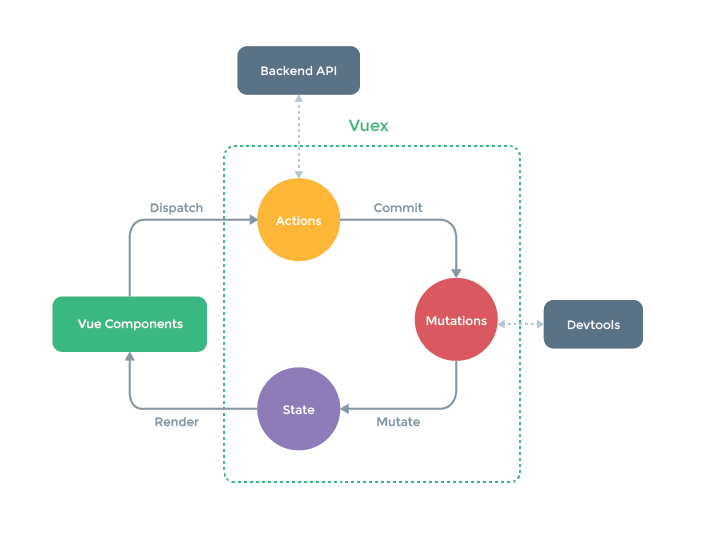

## Vue全家桶学习笔记 Vuex
---
### 1. 介绍  

Vuex 是一个专为 Vue.js 应用程序开发的***状态管理模式***。它采用***集中式存储***管理应用的所有组件的状态，并以相应的规则保证以一种可预测的方式发生变化。

Vuex状态管理图例：


---
### 2. 基本使用 

1. 创建并导出store  

    ```
    import Vue from 'vue'
    import Vuex from 'vuex'

    // 1.安装插件
    Vue.use(Vuex)

    // 2.创建状态对象
    const state = {
        counter: 1000,
        students: [
            {id: 110, name: 'why', age: 18},
            {id: 111, name: 'kobe', age: 24},
            {id: 112, name: 'james', age: 30},
            {id: 113, name: 'curry', age: 10}
        ],
        info: {
            name: 'kobe',
            age: 40,
            height: 1.98
        }
    }

    //创建vuex存储对象
    const store = new Vuex.Store({
        state,
        mutations:{
        },
        actions:{
        },
        getters:{
        },
        modules: {
        }
    })

    // 3.导出store
    export default store
    ```

2. 在Vue中挂载：

    ```
    new Vue({
        el: '#app',
        store,
        render: h => h(App)
    })
    ```

3. 使用状态

    ```
    通过this.$store.state.属性的方式来访问状态
    ```

---
### 3. State

就是保存全局状态信息的地方。可以通过`this.$store.state.属性`的方式进行访问。

+ Vuex的store中的state是响应式的

---
### 4. Getters  

不同地方都需要需要从store中获取一些state变异后的状态，可以使用Getters，与计算属性类似。

1. 定义getters 

    ```
    getters:{
        powerCounter(state) {
            return state.counter * state.counter
        },
        //第二参数为当前的getters
        powerCounterAdd1(state, getters) {
            return getters.powerCounter+1
        }
    },
    ```

2. 使用getters

    ```
    this.$store.getters.powerCounter

    {{$store.getters.powerCounterAdd1}}
    ```

---
### 5. Mutation 

Vuex的store状态的更新唯一方式：***提交Mutation***。

+ 不要在Mutation方法内执行异步操作，应当在Action中执行异步，再调用commit执行Mutation方法。

1. 定义Mutation方法

    ```
    mutations:{
        decrement(state) {
            state.counter--
        },
        //负载用来携带参数
        incrementCount(state, payload) {
            state.counter += payload.count
        }
    },
    ```

2. 使用Mutation

    ```
    //1. 携带的第二参数就是payload
    this.$store.commit('incrementCount',2);

    //2. 整个对象作为payload
    this.$store.commit({
        type: 'incrementCount',
        count: 100
    })
    ```

---
### 6. Action

Action类似于Mutation, 但是是用来代替Mutation进行***异步操作***的。

1. 定义Action方法

    ```
    actions:{
        //context是和store对象具有相同方法和属性的对象。但是在多模块情况下，context代表当前模块
        incrementAsync(context, payload) {
            return new Promise((resolve, reject) => {
                /*异步操作*/
                if(/*结果正确*/)
                    resolve(/*结果*/)
                else
                    reject("错误信息")
            })
        }
    }
    ```

2. 使用Action

    ```
    // 携带的第二参数就是payload
    this.$store.dispatch('incrementAsync', {
        amount: 10
    }).then(data => {
        /*处理结果*/
    })

    // 整个对象作为payload
    this.$store.dispatch({
        type: 'incrementAsync',
        amount: 10
    }).then(data => {
        /*处理结果*/
    })
    ```

---
### 7. Module

当应用变得非常复杂时,store对象就有可能变得相当臃肿.为了解决这个问题, Vuex允许我们**将store分割成模块(Module)**, 而每个模块拥有自己的state、mutation、action、getters等。

1. 定义模块

    ```
    modules: {
        //定义模块a
        a: {
            //如果需要开启命名空间，所有访问字符串变成"a/对应的方法名称"
            namespaced: true,
            state:{
            },
            mutations:{
            },
            actions:{
            },
            getters:{
            },
            modules: {
            }
        }
    }
    ```

2. 使用模块 

    + state 

        ```
        this.$store.state.a.属性
        ```
    + mutation\getter\action  

        默认情况下，模块内部的 action、mutation 和 getter 是注册在**全局命名空间**的——这样使得**多个模块**能够对**同一** mutation 或 action 作出响应。

        你可以通过添加 `namespaced: true` 的方式使其成为带命名空间的模块

        ```
        //没有添加namespaced
        this.$store.commit(...)
        this.$store.dispatch(...)
        this.$store.getters.某一个getter
        
        //添加了namespaced
        this.$store.commit('a/...',...)
        this.$store.dispatch('a/...',..)
        this.$store.getters['a/...',..]
        
        ```

---

#### [返回目录](./)
