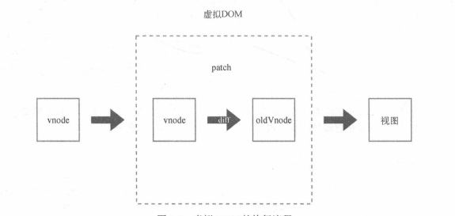

## Vue原理学习笔记 虚拟DOM

---

### 1. 什么是虚拟DOM

渲染：状态作为输入，生成DOM输出到页面上，这个过程。

存在问题：没当状态发生变化，页面重新渲染整个页面，实际上会频繁的操作DOM

**解决方案：使用虚拟DOM（定义）：通过状态生成一个虚拟结点树，然后使用虚拟结点树进行渲染，在渲染之前，会使用新生成的虚拟结点树和上一次生成的虚拟结点树进行对比（diff算法），只渲染不同的部分。**

Vue渲染方式（Vue1.x）：状态变化，重新渲染对应的DOM结点。

Vue渲染方式（Vue2.x）：组件内部建立虚拟DOM，颗粒度中等，以组件为单位进行渲染

### 2. Vue中的虚拟DOM和VNode

以vue2.x为准，通过模板来描述 `状态` 和 `DOM` 之间的关系，Vue通过编译将模板转换成 **渲染函数**，执行渲染函数，就会生成一个 **虚拟结点树（VNode）**，通过这个VNode来渲染页面。

**虚拟DOM的目标**：将VNode渲染到视图上，这里会进行比对(diff)，只将需要改变的DOM结点进行重新渲染。



### 3. VNode详情

VNode是一个**结点描述对象**，它描述了应该怎样去创建真实的DOM结点。

```
export default class VNode {
  tag: string | void;
  data: VNodeData | void;
  children: ?Array<VNode>;
  text: string | void;
  elm: Node | void;
  ns: string | void;
  context: Component | void; // rendered in this component's scope
  functionalContext: Component | void; // only for functional component root nodes
  key: string | number | void;
  componentOptions: VNodeComponentOptions | void;
  componentInstance: Component | void; // component instance
  parent: VNode | void; // component placeholder node
  raw: boolean; // contains raw HTML? (server only)
  isStatic: boolean; // hoisted static node
  isRootInsert: boolean; // necessary for enter transition check
  isComment: boolean; // empty comment placeholder?
  isCloned: boolean; // is a cloned node?
  isOnce: boolean; // is a v-once node?

  constructor (
    tag?: string,
    data?: VNodeData,
    children?: ?Array<VNode>,
    text?: string,
    elm?: Node,
    context?: Component,
    componentOptions?: VNodeComponentOptions
  ) {
    /*当前节点的标签名*/
    this.tag = tag
    /*当前节点对应的对象，包含了具体的一些数据信息，是一个VNodeData类型，可以参考VNodeData类型中的数据信息*/
    this.data = data
    /*当前节点的子节点，是一个数组*/
    this.children = children
    /*当前节点的文本*/
    this.text = text
    /*当前虚拟节点对应的真实dom节点*/
    this.elm = elm
    /*当前节点的名字空间*/
    this.ns = undefined
    /*编译作用域*/
    this.context = context
    /*函数化组件作用域*/
    this.functionalContext = undefined
    /*节点的key属性，被当作节点的标志，用以优化*/
    this.key = data && data.key
    /*组件的option选项*/
    this.componentOptions = componentOptions
    /*当前节点对应的组件的实例*/
    this.componentInstance = undefined
    /*当前节点的父节点*/
    this.parent = undefined
    /*简而言之就是是否为原生HTML或只是普通文本，innerHTML的时候为true，textContent的时候为false*/
    this.raw = false
    /*静态节点标志*/
    this.isStatic = false
    /*是否作为跟节点插入*/
    this.isRootInsert = true
    /*是否为注释节点*/
    this.isComment = false
    /*是否为克隆节点*/
    this.isCloned = false
    /*是否有v-once指令*/
    this.isOnce = false
  }

  // DEPRECATED: alias for componentInstance for backwards compat.
  /* istanbul ignore next https://github.com/answershuto/learnVue*/
  get child (): Component | void {
    return this.componentInstance
  }
}
```


#### 3.1 作用

如果组件只有一个结点发生了变化，重新渲染整个组件的所有结点会产生很大的性能浪费。对VNode进行缓存，将上一次缓存的vnode和当前创建的vnode进行对比，只更新发生变化的结点。

#### 3.2 VNode的类型

##### 3.2.1 注释结点

```
export const createEmptyVNode = text=>{
	const node = new VNode();
	node.text=text;
	node.isComment = true;
	return node;
}
```

```
<!-- 注释结点 -->
对应的VNode应该是这样：
{
	text: '注释结点',
	isComment: true
}
```

##### 3.2.2 文本结点

```
export function createTextNode(val){
	return new VNode(undefined, undefined, undefined, String(val))
}
```

```
对应的VNode应该是这样：
{
	text: 'Hello World'
}
```

##### 3.2.3 克隆结点

主要用于 `优化静态结点(状态不变化的结点)`  和 `插槽结点` 

```
export function cloneVNode(vnode,deep){
	const cloned = new VNode(
		vnode.tag,
		vnode.data,
		vnode.children,
		vnode.text,
		vnode.elm,
		vnode.context,
		vnode.componentOptions,
		vnode.asyncFactory
	);
	cloned.ns = vnode.ns;
	cloned.isStatic = vnode.isStatic;
	cloned.key = vnode.key;
	cloned.isComment = vnode.isComment;
	cloned.isCloned = true;
	if(deep && vnode.children){
		cloned.children = cloneVNode(vnode.children,deep);
	}
	return cloned;
}
```

克隆结点和源节点的唯一区别是，克隆结点的 `isCloned` 为true。

##### 3.2.4 元素结点

```
export const createElVNode = (context,tag,data,children)=>{
	const node = new VNode();
	node.context = context;	//当前组件的Vue实例
	node.tag = tag;	//标签名称
	node.data = data;	//结点属性（attrs\class\style等）
	node.children = children;	//子结点列表
	return node;
}
```

```
<p><span>Hello</span><span>Berwin</span></p>
对应的Vnode应该是这样：
{
	children:[VNode,VNode],
	context: {...},
	data: {...},
	tag: "p"
}

```

##### 3.2.5 组件结点

组件结点和元素结点类似，有以下两个独有的属性：

1. componentOptions: 组件的选项参数
2. componentInstance: 组件实例，就是Vue的一个实例

```
<child></child>
对应的VNode结点应该是这样：
{
	componentOptions: {...},
	componentInstance: {...},
	context: {...},
	data: {...},
	tag: "vue-component-1-child"
}
```

##### 3.2.6 函数式组件结点

函数式组件结点和组件结点类似，两个独有的属性和组件结点不同：

1. functionalContext: 函数式组件的Vue实例
2. functionalOptions: 函数式组件的选项参数

```
<child></child>
对应的VNode结点应该是这样：
{
	functionalOptions: {...},
	functionalContext: {...},
	context: {...},
	data: {...},
	tag: "vue-component-1-child"
}
```


### 4. Diff算法


---

#### [返回目录](./)

