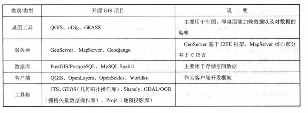
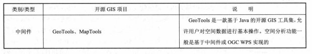
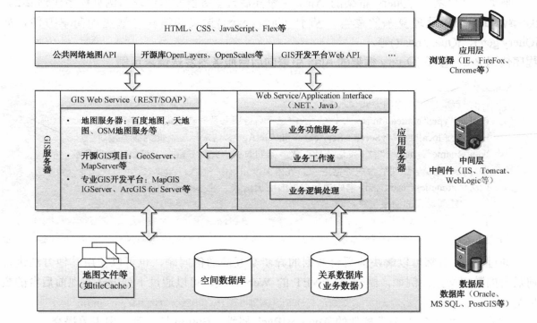

## WebGIS学习笔记 WebGIS介绍

---

### 1. GIS（Geographic Information System）

地理信息系统（Geographic Information System），是一种特定得十分重要得空间信息系统，以采集、存储、管理、检索、分析和描述空间物体得定位分布及与之相关的属性数据的计算机系统。

### 2. WebGIS（网络地理信息系统）

基于网络平台，采用网络协议运行再网络上的地理信息系统，常见的开源WebGIS平台：

web客户端：主要用于展示地理信息

服务端：发布地图数据服务

数据层：1.使用公共在线地图服务数据（百度地图、天地图、openstreatmap等），一般作为底图使用 2.使用服务器端的地图数据

### 3. Web Service

Web服务向外界暴露出一个能够通过Web进行调用的API，用户能够采用编程的方法通过Web来调用该API。主要分为2种：

1. 基于SOAP的Web Service：SOAP是在分布式的环境中交换信息的简单协议，通信协议可以是HTTP等，也可以是特定的定制协议。基于SOAP的Web Sevice一般是通过服务代理类进行调用的。
2. 基于REST的Web Service：REST(Representational State Transfer)，基于REST的Web Service是一组非常便于理解的URL，将互联网上的一切都表示为资源，对函数的调用转化为对资源的HTTP请求。

### 4. WebGIS的框架结构

其中GIS服务器可以是专业的GIS开发平台，开源GIS项目，也可以是地图服务器，主要为应用层提供地图数据服务和功能资源服务。

---

#### [返回目录](./)

