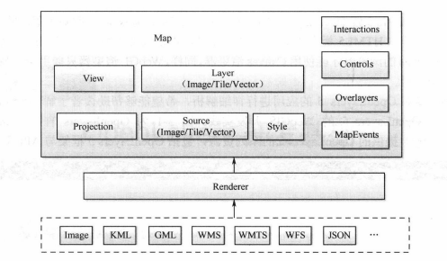

## WebGIS学习笔记 OpenLayers介绍

---

### 1. 简介

OpenLayers是一个模块化、高性能并且功能丰富的WebGIS客户端JavaScript包，用于显示地图以及空间数据，并与之进行交互，且具有灵活的扩展机制。

OpenLayers实现访问空间数据的方法符合行业标准，支持各种公开的和私有的数据标准和资源。支持OGC定制的WMS\WFS等服务规范，支持的数据格式有：XML、JSON、GeoJSON、MVT、GML、GPX、KML、WFS、WKT等。

### 2. Openlayers5的体系架构



Map：整个地图容器

Layer：地图图层

Source：图层的数据源

Style：矢量图层样式

View：地图视图

### 3. 实例

```
new Map({
      target:'map',
      layers:[
        new TileLayer({
          //高德影像底图
          source: new XYZ({
            url: "http://wprd0{1-4}.is.autonavi.com/appmaptile?x={x}&y={y}&z={z}&lang=zh_cn&size=1&scl=1&style=6",
          }),
        }),
        new TileLayer({
          //高德路网切片
          source: new XYZ({
            crossOrigin: "anonymous",
            url: "http://wprd0{1-4}.is.autonavi.com/appmaptile?x={x}&y={y}&z={z}&lang=zh_cn&size=1&scl=1&style=8",
          }),
        })
      ],
      view: new View({
        center:[114.2905,30.5607],
        projection: "EPSG:4326",
        minZoom:2,
        zoom:21
      })
    })
```


---

#### [返回目录](./)

