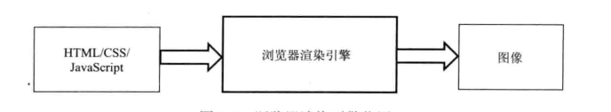
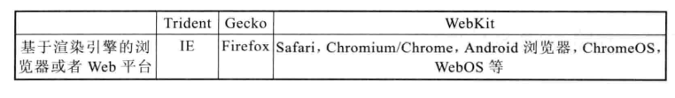
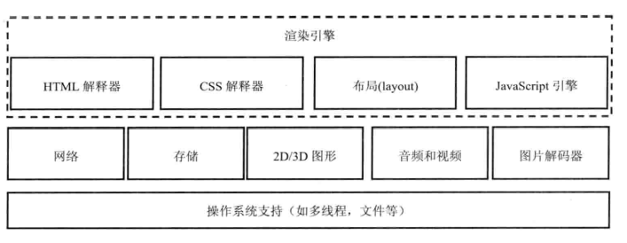
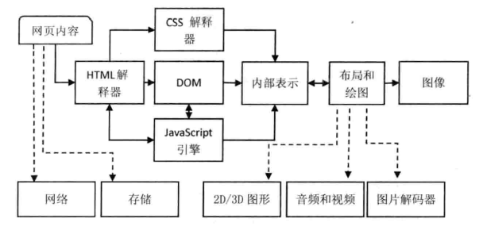
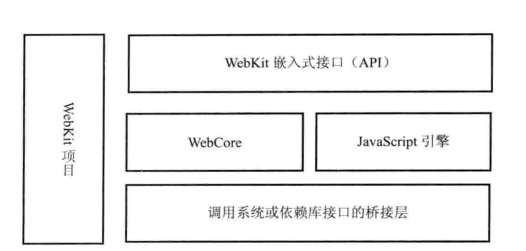

## WebKit学习笔记 浏览器及内核介绍

---

### 1. 内核和主流内核介绍

浏览器内核：也叫渲染引擎，主要的作用是将页面转变成可视化的图像结果。

目前主流的渲染引擎包含Trident、Gecko和WebKit（Blink），分别是IE、火狐和Chrome的内核。

### 2. 内核特征

渲染引擎模块及其依赖的模块

+ HTML解释器：解释HTML文本的解释器，主要作用是将HTML文本解释成DOM树
+ CSS解释器：级联样式表的解释器，它的作用是为DOM中的各元素对象计算出样式信息，从而为计算最后网页的布局提供基础设施。
+ 布局：在DOM创建之后，WebKit需要将其中的元素对象同样式信息结合起来，计算他们的大小位置等布局信息，形成一个能够表示这所有信息的内部表示模型
+ JavaScript引擎：JavaScript引擎能够解释JS代码并通过DOM接口和CSSOM接口来修改网页的内容和样式信息，从而改变渲染的结果。
+ 绘图：使用图形库将布局计算后的各个网页的节点绘制成图像结果。

**渲染引擎的一般渲染过程及各阶段依赖的其他模块**：

### 3. WebKit内核

### 4. Blink

与Webkit不同：

+ 实现跨进程iframe
+ 重新整理和修改Webkit关于网络方面的架构和接口
+ 各种性能优化

---

#### [返回目录](./)

