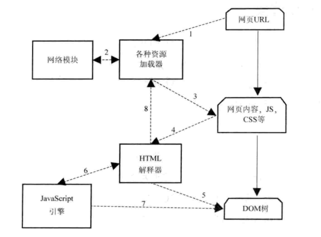
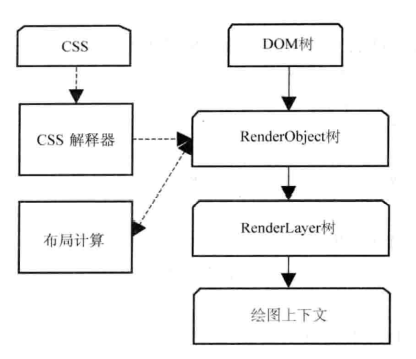
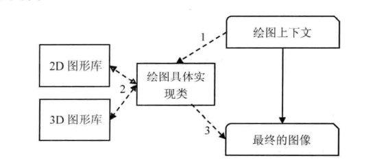

## WebKit学习笔记 渲染过程

---

### 1. 加载和渲染

1. 用户输入URL，WebKit调用其资源加载器加载该URL对应的网页。
2. 加载器依赖网络模块建立连接，发送请求并接收答复。
3. WebKit接收到各种网页或者资源的数据
4. 网页被交给HTML解释器转换为词语
5. 解释器根据词语构建节点，形成DOM
6. 如果节点是JS代码，交给JS引擎
7. 如果节点需要依赖其他资源，调用资源加载器来加载它们

**在上述过程中，网页在加载和渲染过程中会发出"DOMConent"事件和DOM的“onload”事件，分别在DOM树构建完之后，以及DOM树建完并且网页所以来的资源都加载完之后发生**。

接下来是WebKit利用CSS和DOM树构建RenderObject树直到绘图上下文

1. CSS文件被CSS解释器解释成内部表示结构。
2. CSS解释器工作完之后，在DOM树上附加解释后的样式信息，这就是RenderObejct树
3. RenderObject节点在创建的同时，WebKit会根据玩也的层次结构创建RenderLayer树，同时构建一个虚拟的绘图上下文。

最后根据绘图上下文来生产最终的图像，这一过程主要依赖2D和3D图形库：

1. 绘图上下文是一个与平台无关的抽象类，它将每个绘图操作桥接到不同的具体实现类，也就是绘图具体实现类。
2. 绘图实现类将2D图形库或者3D图形库绘制的结果保存下来，交给浏览器来同浏览器界面一起显示。

---

#### [返回目录](./)

