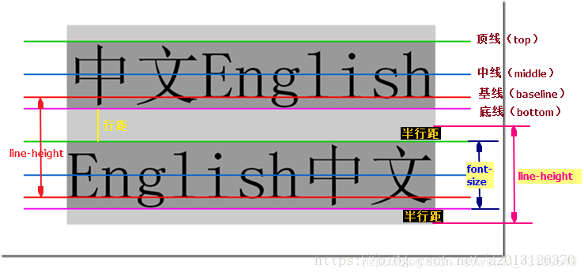

## 前端面试错题集 CSS样式：line-height、height与font-size的联系

类似于之前小学写字学习的四线三格，分为顶线（top）、中线（middle）、基线（baseline）、底线（bottom）。
（1）行高是指文本行基线间的垂直距离。
（2）行距是上一行的底线和下一行的顶线之间的距离。
行距的一半就是半行距。上间距等于下间距。
（3）字体大小是同一行的顶线和底线之间的距离。

从图中可以看出：
行高=行间距+字体大小=上半行距+字体大小+下半行距

---

#### [返回目录](./)

