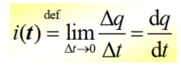
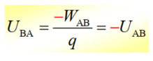
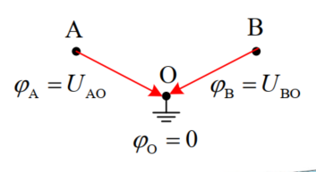

# 电路模型与电路元件

## 1. 电路与电路模型

### 1.1 电路

1. 电路的概念：由实际电工设备构成的整体，它为电流的流通提供路径。
2. 电路的构成：电路主要由电源、负载、连接导线及开关等构成。

 > 电源(source)：提供能量或信号的发生器。
 > 负载(load)：将电能转化为其它形式能量的用电设备，或对信号进行处理的设备。
 > 导线(line)、开关（switch)：将电源与负载接成通路的装置。

### 1.2 理想电路元件

根据实际电路元件所具备的电磁性质来设想的具有某种单一电磁性质的元件，其u，i关系可用简单的数学公式严格表示。

几种基本的理想电路元件：

> 电阻元件：表示消耗电能的元件。
> 电感元件：表示各种电感线圈，能够产生磁场，储存磁场能的元件。
> 电容元件：表示各种电容器，能够产生电场，储存电场能的元件。
> 电源元件：表示各种将其它形式的能量转变成电能的元件。

### 1.3 电路模型

由理想元件及其组合代表实际电路元件，与实际电路具有基本相同的电磁性质，称其为“电路模型”。电路模型是由理想电路元件构成的。

 电路模型近似地描述实际电路的电气特性。根据实际电路的不同工作条件以及对模型精确度的不同要求，应当用不同的电路模型模拟同一实际电路。

### 1.4 集总参数元件与集总参数电路

1. 集总参数元件：在任何时刻，流入二端元件的一个端子的电流一定等于从另一个端子流出的电流，两个端钮之间的电压为单值量。
2. 集总参数电路：由集总参数元件构成的电路。

一个实际电路要能用集总参数电路近似，要满足如下条件：即实际电路的尺寸必须远小于电路工作频率下电磁波的波长。

## 2.电路中主要物理量

### 2.1 电流

电流：带电质点的运动形成电流。单位： A (安) (Ampere，安培)

电流大小用电流强度表示：单位时间内通过导体截面的电量。

### 2.2 电压

电压(voltage)： 电场中某两点A、 B间的电压(降) $U_{AB}$  等于将点电荷q从A点移至B点电场力所做的功$W_{AB}$与该点电荷q的比值， 单位： V (伏) (Volt，伏特)

当把点电荷q由B移至A时，此时可等效视为电场力做了负功 $-W_{AB}$ ，则B到A的电压为  

### 2.3 电位

电位： 电路中为分析的方便，常在电路中选某一点为参考点，把任一点到参考点的电压称为该点的电位 。电位用表示，单位是V(伏)。

参考点的电位一般选为零，所以，参考点也称为零电位点。

结论1： 电路中任意两点间的电压等于该两点间的电位之差。  

结论2： 电路中电位参考点可任意选择；当选择不同的电位参考时，电路中各点电位会发生改变，但任意两点间电压保持不变。  

### 2.4 电动势

